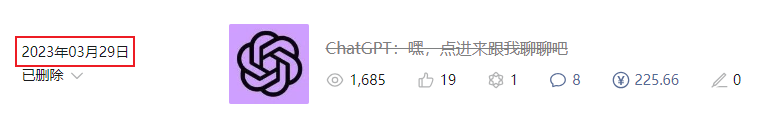

# Pandora大佬退出，免费时代落幕

:::warning 本文写于 2024-01-23
公号文章：[Pandora大佬退出，免费时代落幕](https://mp.weixin.qq.com/s/0DFNsemz5JnTHs6LCYo-3A)
:::

带着一些伤感写这篇文章。

因为昨天傍晚看到了Pandora大佬的告别贴：

这意味着我给各位读者免费提供的

**原味 GPT也将于1月30日一起停服**。

而简洁GPT 里 gpt-3.5-turbo用的也是Pandora的chat2api逆向代理，也无法继续使用了。

当然还有 Google 的Gemini Pro，但目前效果差强人意吧，之前也只是供各位尝鲜，用过ChatGPT就回不去了，所以干脆

**简洁 GPT一起停服了**。

总而言之，后面很难再有像Pandora这样🐂🍺的开源项目了，免费时代落幕。

emo了，于是我打算也写写过去一年的经历，提前跟大伙一起怀念即将失去的免费服务。

我算是比较早提供免费 ChatGPT 服务的。

去年3月份那会最火的前端项目还是Chanzhaoyu 的 chatgpt-web。

既可以直接用官方的 API Key（付费），也支持其他第三方 chat2api 逆向的代理(免费)。

于是我就用chatgpt-web，后台配上自己的Key，提供了第一个可以免费给读者使用的ChatGPT。

**那是梦开始的地方**。

那会儿ChatGPT是真的火，我记得当时可能就200+用户关注，一个月之后就涨到了600+，第一个月的账单好像是49美元，大家打赏的收入可以覆盖，所以我得以继续更新跟进。

大概4月底，chatgpt-web 停更，Chanzhaoyu 开始做闭源的商业版chatgpt-web-plus，加上了后台管理，需要用户注册登录，APK Key的管理分发等，一套卖1000，准备开始变现，所以我不得不转向其他的开源项目，同时开始研究如何使用第三方的chat2api，让大家免费使用chatgpt-web。

5月初，我一眼相中了Yda 的ChatGPT-Next-Web（就是目前简洁GPT 和 尊享GPT 的前身），同样后台搭配我自己的API Key，给大家免费用，靠公众号用户赞赏补贴。

之后的几个月我把API月账单 和 赞赏的榜单贴出来公开感谢，现在回想起来挺美好的，衷心感谢第一批用户，没有你们的支持，也走不到今天。

5月中旬，我终于搞明白了chat2api 逆向代理怎么使用。

于是就用当时比较火的linweiyuan 的 go-chatgpt-api 自己搭了一个代理服务，然后把chatgpt-web 接上，第一个真正可以免费使用的ChatGPT服务就诞生了。

当然，如Pandora大佬所言，逆向工程的项目，OpenAI改一个参数，他就要跑断腿，go-chatgpt-api 也面临同样的问题，为了维护免费的chatgpt-web，我经常要同步go-chatgpt-api 的更新，于是我就想找个稳定的，由作者直接维护的逆向代理服务。

通过chatgpt-web的更新日志，我找到了zhile大佬，并且发现他不止提供逆向代理，本身还提供官方镜像服务，于是我赶紧消化，然后在5月底为读者带来官方原汁原味的ChatGPT。

并且我还给这三个不同作者提供的ChatGPT起了名字：

Chanzhaoyu 的 chatgpt-web，

我叫它 **简洁 GPT**

zhile大佬的Pandora，

我叫它 **原味 GPT**

Yda 的ChatGPT-Next-Web，

我叫它 **尊享 GPT**

（因为这个依旧是调用API的，最稳定，但需要持续充值）

这样就构成了整个公众号提供的ChatGPT服务版图。

之后的几个月：

- GPT4发布，因为众筹模式无法解决用量公平问题，所以我又上线了API中转服务，只是为了抵消成本，并解决让大家按量付费的问题。

- 2023年9月9日，Pandora项目一夜无了。

    好在9月13日，Zhile新开账号恢复，我松了口气。

    *注：GitHub 和 OpenAI的大股东都是微软。*

- 2023年10月24日，linweiyuan 的 go-chatgpt-api 停更，理由很心酸。。。以后逆向代理全靠zhile大佬了。

- 2023 年11 月6 日，OpenAI 举行了首个开发者大会DevDay，AI春晚名不虚传，而我的中转服务也第一次及时跟进。

- 2023年11月9日 zhile大佬的账号再次被删，Pandora又无了。这次大佬一怒，直接掏出了全新的pandora-next （就是现在的原味GPT）。

而我选择继续跟进。

第一件事情：**把 简洁GPT 的前端替换成 Yda 的ChatGPT-Next-Web**。

因为之前的chatgpt-web已停更半年，再加上go-chatgpt-api 停更，我选择Yda 和 zhile的组合来继续提供免费的ChatGPT。

第二件事情，将**原味GPT升级为pandora-next**，没想到这么受欢迎，直接起飞了。。。

**在升级原味GPT之前，我的公众号关注人数1500不到，而发布的一个月之后，已经到5500+了**。

- 2023年12月初，Yda卖掉了ChatGPT-Next-Web，又一位大佬退出了用爱发电的阵营。

这也是为啥 尊享 GPT 之后有近两个月未更新。

直到最近我接受了Yda已经离开的现实，从茫茫多的下游二开版本中，挑选了基于Langchain实现的带插件的ChatGPT-Next-Web，带联网搜索功能，而且作者也在持续更新，也算对尊享GPT用户有个交代。

只是可能用户多了，审核变严格了，现在很多文章我发不出去了，所以不得已搭了个人网站，来放功能介绍和入口，公众号严格到只能发发图片了。

最后，就是昨天刚刚得知的，zhile大佬也要退出用爱发电阵营了。

从去年3月份开始一路走来，

如果

没有**Chanzhaoyu 的 chatgpt-web**，

没有**linweiyuan 的 go-chatgpt-api**，

没有**Yda的ChatGPT-Next-Web**，

没有**zhile的Pandora 和 Pandora-Next**，

没有第一批相信我的公众号用户，

就没有如今的一切，现在各位大佬相继离去，我也很不舍。

这段时间，我经历了：

- 自学计算机网络；

- 买了各种云服务器厂商的机器，域名；

- 捣鼓过谷歌的gcp，亚马逊的aws，微软的Azure，Oracle Cloud，阿里云，腾讯云。。。

- 研究了Cloudflare，腾讯云的CDN加速，就为了让大家的访问速度能快一点；

- 当然部署要用到的Nginx，Docker，npm也都是这段时间掌握的；

- 为了搭个人网站前后花了3周才掌握了VuePress2的部署和使用，学习曲线有点陡峭，但还是坚持下来了。

...

我成长了很多，所以对于大佬们，对于各位用户我也是衷心感谢，如果不是每天看着 原味 GPT 上有6000多条对话，我也没有动力这样维护下去，我们都赢麻了不是吗？

当然这一切在2024年1月30日之后，会迎来暂时的句号。

**尊享GPT 不受影响，可以继续使用。**

Yda离开了，新团队接手了ChatGPT-Next-Web，规划的路线图蛮宏伟，只不过暂时不能免费了。

后面等这些大佬们哪天重出江湖，或者又有引领风骚的新人出现，我再继续为各位提供免费有趣的Ai服务吧。（目前手头有一些，只是受众没那么广，等我平复几天再说吧）

*群里吹水的时候，zhile说他好久没有节假日出去露营了，我想感谢Pandora 大佬，但奈何* **他就是赛博菩萨，香火钱都供不上，只能心中默默感恩了🙏。** 

