# Claude 代理站

🎉欢迎使用 AI自强少年 提供的 Claude 公益站。

👉访问链接：[Claude 代理站](https://claude.hugai.top)；

👉网站密码，**请在公众号回复 gpt 获取**。

🚦网络环境：请在外部浏览器打开链接，微信可能屏蔽了本站域名。。。

## 这是什么？

Claude 是由号称OpenAI孪生兄弟的Anthropic 推出的产品，其中 Claude 3.5 Sonnet 目前在大模型排行榜上仅次于gpt-4o，而且有免费的体验额度，值得分享给各位。

同样的，因为国内无法直接访问，我这里依旧是接力逆向大佬**我是秦始皇** 为大家提供国内直连的服务，包括**账号注册，登录，及官方镜像网页**。

## 如何使用？

为了照顾到小白朋友，我特意录制了一个视频，**从注册账号到登录使用**，3分多钟，看一遍就都明白啦：

<iframe src="https://home.aiporters.com/videos/claude.webm" allow="fullscreen" allowfullscreen="" width="800" height="450" style="border:0"></iframe>

下面这个是各个步骤的文字描述👇

1. 请在公众号菜单栏获取[Claude的访问链接](https://claude.hugai.top);

2. 浏览器中打开之后，需要填写网站密码，**公众号回复 gpt 就能得到密码**了，老朋友都知道了;

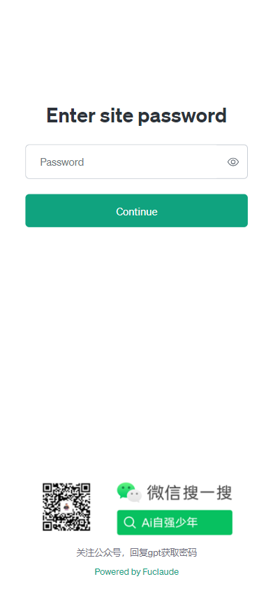

3. 下一个页面，请填写一个真实的邮箱（就是你的Claude账号），注意不要用国内的qq，163等邮箱;

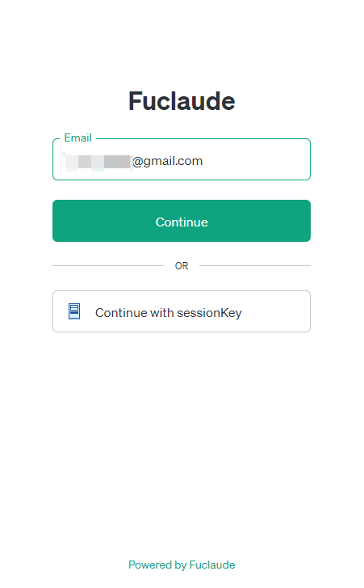

4. claude会给你的邮箱发送一个安全链接，国内的网络不要直接点，而是要去邮箱复制安全链接，然后填入下面的框里，再继续，具体看下面三个图：

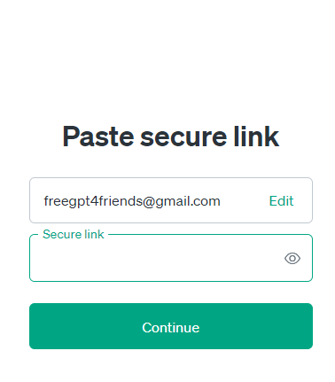

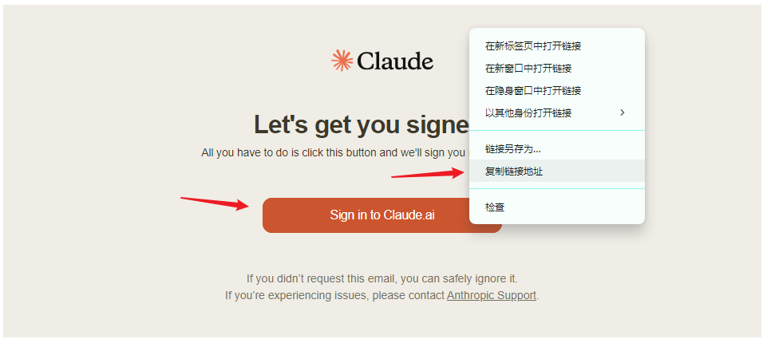

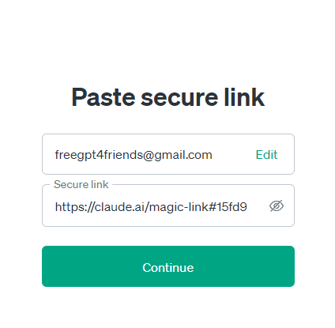

5. 如果你是新用户，会进入创建账号的页面，这里最难的部分是需要你填一个国外的手机号;

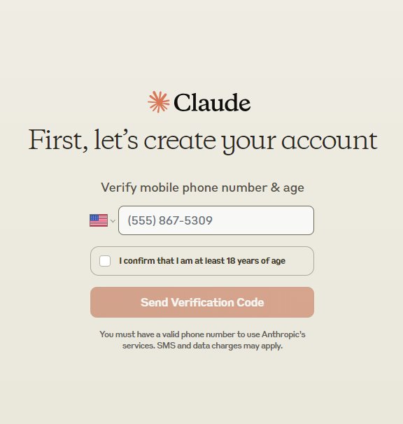

6. 打开接码平台：[sms-activate.io](https://sms-activate.io/) 或者 https://5sim.net/ 注册一个账号，充一点钱。

7. 在左侧的服务搜索 Claude, 选一个支持访问Claude的国家，比如英格兰，点购物车购买一个虚拟号码；（这里演示的是sms-activate.io 的操作步骤）;

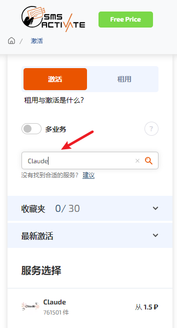

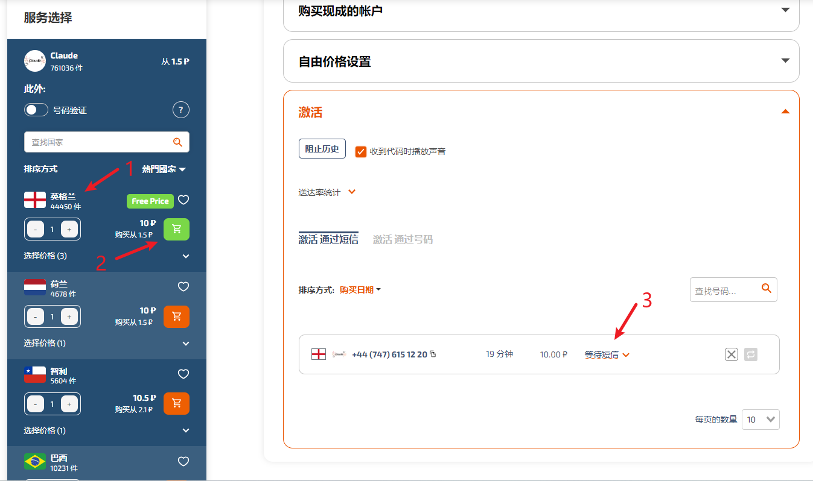

8. 回到第5步的页面，国家选择英格兰，填写买到的虚拟号码，点发送验证码;

9. 在接码平台上收到验证码之后，填入并验证，至此账号创建成功，你将进入Claude 的聊天界面；

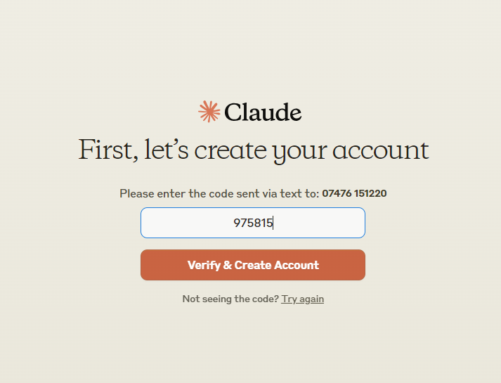

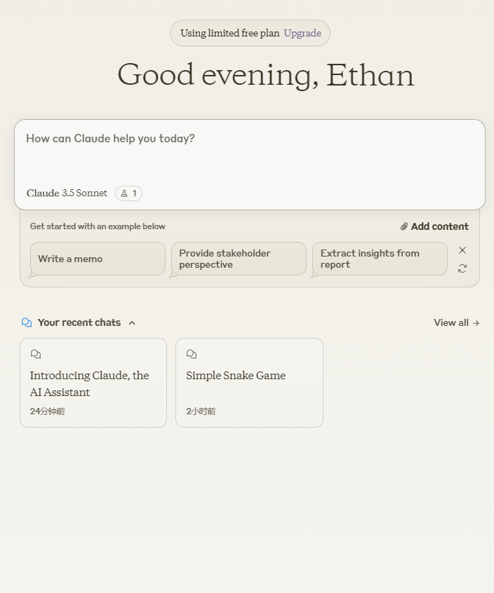

10. Claude 新推出的Artifacts功能也支持了，开启方式如下：

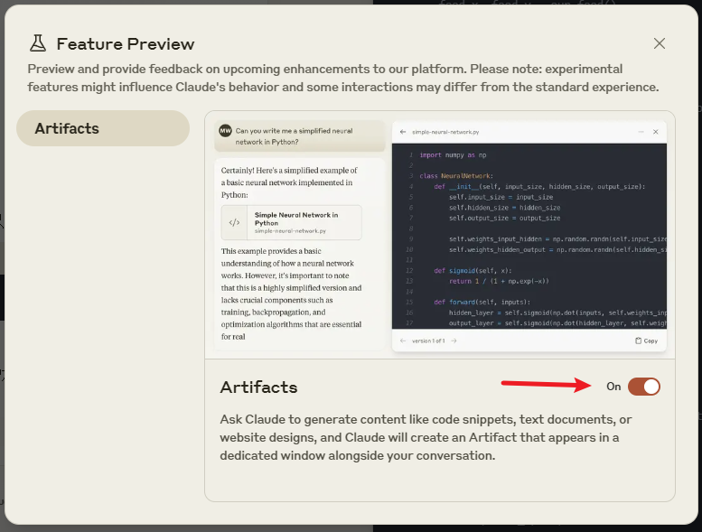

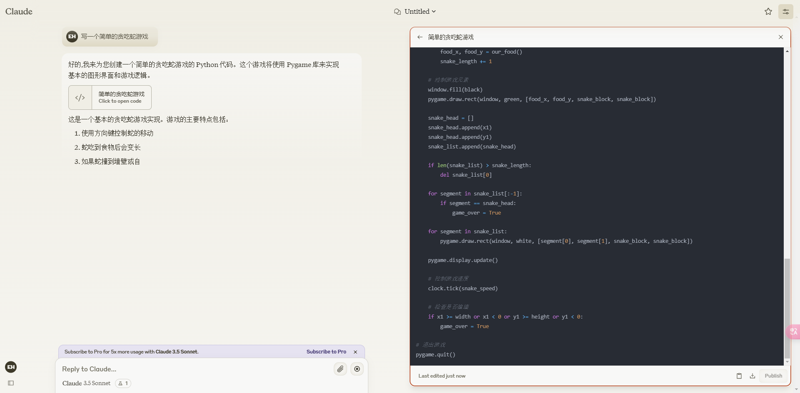

## 使用的注意事项

- 可用性：这个服务可用，需要同时满足我接力提供的逆向服务，Claude的官方服务 二者都正常才行。如果出现持续性的报错，无响应，请在公众号私信我，帮自己也是帮大家。

最后，如果觉得这个事情对你有帮助，或者能帮助到你的朋友，求个免费的转发或者在看，不急于现在，你用它三个月，三个月后再分享也成。