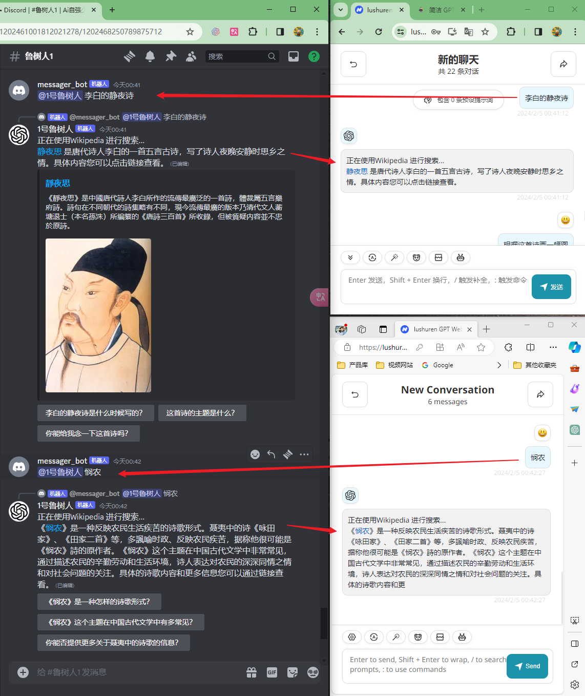

# 鲁树人GPT 介绍

🥳欢迎使用 Ai自强少年 提供的免费 GPT网页服务，本文介绍全新的 鲁树人GPT。

✨鲁树人GPT 使用 gpt-4，现在可以通过Google搜索信息，使用DallE 3作图，用LinkReader解析网页，从维基百科获取信息，甚至是编写Python代码。

👉访问地址：[鲁树人GPT](https://lushuren.hugai.top)，访问密码 在公众号回复 **gpt** 获得。

🚦网络环境：各地网络环境不同，如无法访问则说明缘分未到，不必勉强。若是钢铁般的需求，可以公众号私信联系，我帮你想想办法。

## 为什么叫 "鲁树人GPT"?

区分chatgpt背后的模型是 gpt-3.5 还是 gpt-4 有一个经典问题：

**鲁迅为什么要打周树人？**

如果一本正经地回答为啥打架，那就是gpt-3.5，因为他不懂的会杜撰；

如果能指出这两是同一个人，那就是更聪明的gpt4啦；

所以我们可以把这个问题简化为 "鲁树人问题"，能回答对这个问题的就叫他：鲁树人GPT；

## 鲁树人GPT 有啥用？

### 1. 默认使用OpenAI的gpt4

而且我已经为鲁树人添加了5个插件功能：

- #### 使用google联网搜索

- #### 用DALLE 3文生图

- #### 用LinkReader解析网页

- #### 从wiki百科里搜索信息

- #### 调用Code Interpreter写python代码

或者你可以直接问鲁树人有哪些技能，然后再决定要不要用这些技能来辅助回答问题：

**另外，鲁树人的技能（插件功能）是可以继续扩充的；**

所以各位在使用过程中，如果有常用的功能需求，可以留言或者私信，我找找有没有现成的插件，调试好提示词后就可以让鲁树人升级一下。

### 2. 支持Google的Gemini Pro

把模型切换成 gemini-pro，鲁树人就变成Google家的智能助理了：

## 如何使用？

登录网页后，按页面上的提示操作即可：

::: tip 注意：
当你在公众号回复 **gpt** 的时候，会发现鲁树人GPT 有多个密码；

每个密码代表一个频道，每个频道都有对应的鲁树人在等着你，功能都是一样的；

**填不同的密码会自动进入对应的频道；**

所以强烈建议大家用掷色子选密码，随机，不要挤在一个频道里，才能达到真正的负载均衡，大家的体验也会更好。
:::

## 为什么可以免费？

这就要讲讲实现原理了。

### 1. 通过Coze白嫖gpt4 和 DALLE 3

字节在海外发布了一个产品叫Coze，免费供大家使用gpt4 和 DALLE 3(国内同款叫"扣子"，但调用的是自家的云雀大模型)；

#### [Coze 是什么？​](https://www.coze.com/docs/zh_cn/welcome.html)

字节官方介绍：Coze 是一款用来开发新一代 AI Chat Bot 的应用编辑平台，无论你是否有编程基础，都可以通过这个平台来快速创建各种类型的 Chat Bot，并将其发布到各类社交平台和通讯软件上。

比如我们的 **鲁树人就是通过Coze发布在Discord平台上的机器人**，在Discord的频道里@鲁树人，他就会自动调用gpt4来回答你的问题。

但是国内用不了Discord，怎么办？

这个时候就又有"好事者"出手了(感恩开源大佬)，大佬开发了一个[coze-discord-proxy](https://github.com/deanxv/coze-discord-proxy) 代理服务，可以通过接口调用被coze托管的discord-bot。

这样我们就可以在Discord上先创建一个"信使"机器人，然后我们在NextChat客户端发消息给"信使"，通过信使来@鲁树人，然后再把鲁树人的回复返回给NextChat客户端。

给大伙画个图来说明这个消息传递流程（你说这不是图，我也没办法）：

[鲁树人GPT](https://lushuren.hugai.top) → [coze-discord-proxy](https://github.com/deanxv/coze-discord-proxy) → Discord → Coze → OpenAI

再录个1分钟的小视频，直观展示一下效果吧：

<iframe src="https://flix.visionwx.com/share/?video=65bf9b7e3d2da3627dd0671f" allow="fullscreen" allowfullscreen="" width="560" height="315" style="border:0"></iframe>

链条这么长，用的人多，势必就会慢一些，但免费啊，只能原谅他了。

### 2. 通过Google API Key 免费使用Gemini Pro

Gemini Pro目前用的是我个人的API Key，免费但是有流控：每分钟可以请求60次，即一秒可以问一个问题。

## 使用上有哪些注意事项？

### 1. 多人共用gpt4模型时，鲁树人不支持上下文记忆

用两个截图来说明 **在gpt4模式下** 鲁树人 存在的缺陷：

我模拟了两个人在鲁树人1频道同时跟1号鲁树人对话：

- 用户A：李白的静夜思

  - 1号鲁树人：窗前明月光。。。

- 用户B：悯农

  - 1号鲁树人：锄禾日当午。。。

这个时候，用户A紧接着追问，就会出现下面这种情况：

- 用户A：根据这首诗画一幅图

  - 1号鲁树人：根据悯农创作一幅图。。。

这种情况下，用户B的聊天内容变成了用户A 的历史消息了，上下文就串掉了，用户A会觉得莫名其妙，什么东西。。。

所以，**在多人同时使用的情况下，鲁树人GPT 仅适用于一次性返回答案的场景。**

比如：**根据李白的静夜思画一幅图**，这样完整的提示词。

或者夜深人静，你独自承包了整个频道的情况下，可以连续聊天。

你说这样的体验是不是很糟糕，是啊，但是免费。。。

### 2. 插件的调用由鲁树人自行决定

有时候你可能会希望鲁树人帮你连网搜索，但却发现它并没有这么做，可能是因为你说得**太隐晦**，对小助理下命令，可以直接一点，比如：**帮我在网上搜索xxx**

当然，在使用插件功能之前，可以**先问一下鲁树人有哪些技能**，再针对性地提示，就可以大大提高插件命中率啦。

### 3. 有时候会碰到插件调用次数的限制

插件调用有频率的限制，如果出现如下提示，说明流控了，你可以等一会再试，或者换个密码，切换到另一个频道去试试。

## 后续有什么规划？

Coze的可玩性很高，除了支持很多插件之外，还有**工作流，本地知识库，数据库**等等，这些都等着我去继续发掘研究。

Pandora大佬退出之后，原味GPT 和 简洁GPT 已经停服1周了。

我知道你们很急, 但你们先别急。。。

这次我就先把最通用的几个插件加上，调试好就把 鲁树人GPT 放出来啦，免费事业后继有人了，😭，都给我😭。

后续除了增加插件功能之外，我更关心鲁树人的负载能力：

**目前就一个信使，6个频道对应6个鲁树人。**

如果响应不过来，可以横向增加频道和鲁树人的数量，甚至可以增加多个信使轮流传递消息，看大家的使用情况再定吧。

现在，请大家用，狠狠地用，用到字节受不了要收费为止。

在使用过程中，有什么问题欢迎留言或者私信告知，就这些，提前祝大家新年快乐！🎉🎉🎉

