# 鲁树人 GPT [停服归档]

:::warning 最新动态 2024-07-03
鲁树人 GPT 已停服，原因：[地主家也没有余粮了，感谢和告别 鲁树人GPT](https://mp.weixin.qq.com/s/qqWlXDONXEmsmeARiXOwJg)
:::

🥳欢迎使用 Ai自强少年 提供的免费 GPT网页服务，本文介绍全新的 鲁树人GPT **V2.1**。

✨鲁树人GPT 使用 gpt-4o，现在可以通过Google搜索信息，使用DallE 3画图，gpt-4v读图，用LinkReader解析网页，从维基百科获取信息，甚至是编写Python代码。

👉访问地址：[鲁树人GPT](https://lushuren.hugai.top)，访问密码 在公众号回复 **gpt** 获得。

🚦网络环境：各地网络环境不同，如无法访问则说明缘分未到，不必勉强。若是钢铁般的需求，可以公众号私信联系，我帮你想想办法。

## 为什么叫 "鲁树人GPT"?

区分chatgpt背后的模型是 gpt-3.5 还是 gpt-4 有一个经典问题：

**鲁迅为什么要打周树人？**

如果一本正经地回答为啥打架，那就是gpt-3.5，因为他不懂的会杜撰；

如果能指出这两是同一个人，那就是更聪明的gpt4啦；

把这个问题简化为 "鲁树人问题"，能回答对的就叫他：鲁树人GPT；

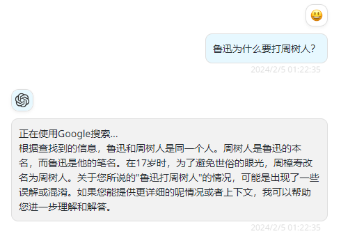

## 鲁树人GPT 有啥用？

### 1. 能用OpenAI的gpt4

而且我已经为鲁树人添加了6个插件功能：

- #### 使用google联网搜索
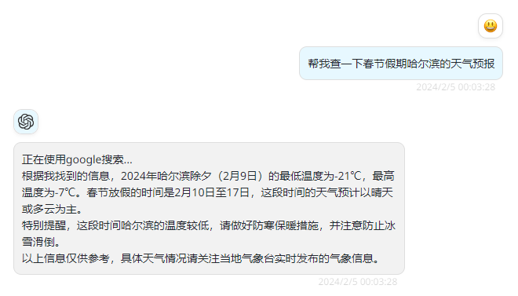

- #### 用DALLE 3文生图
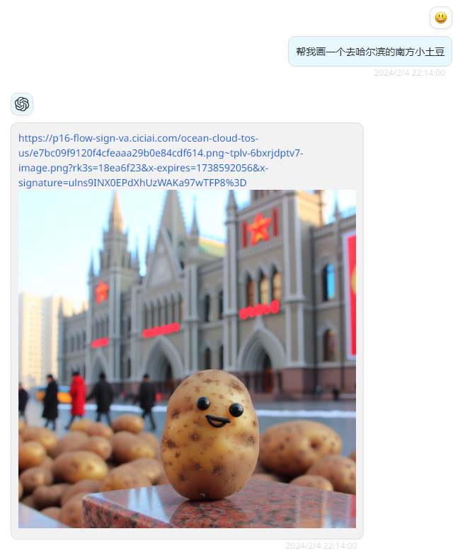

- #### 用GPT-4v 读图
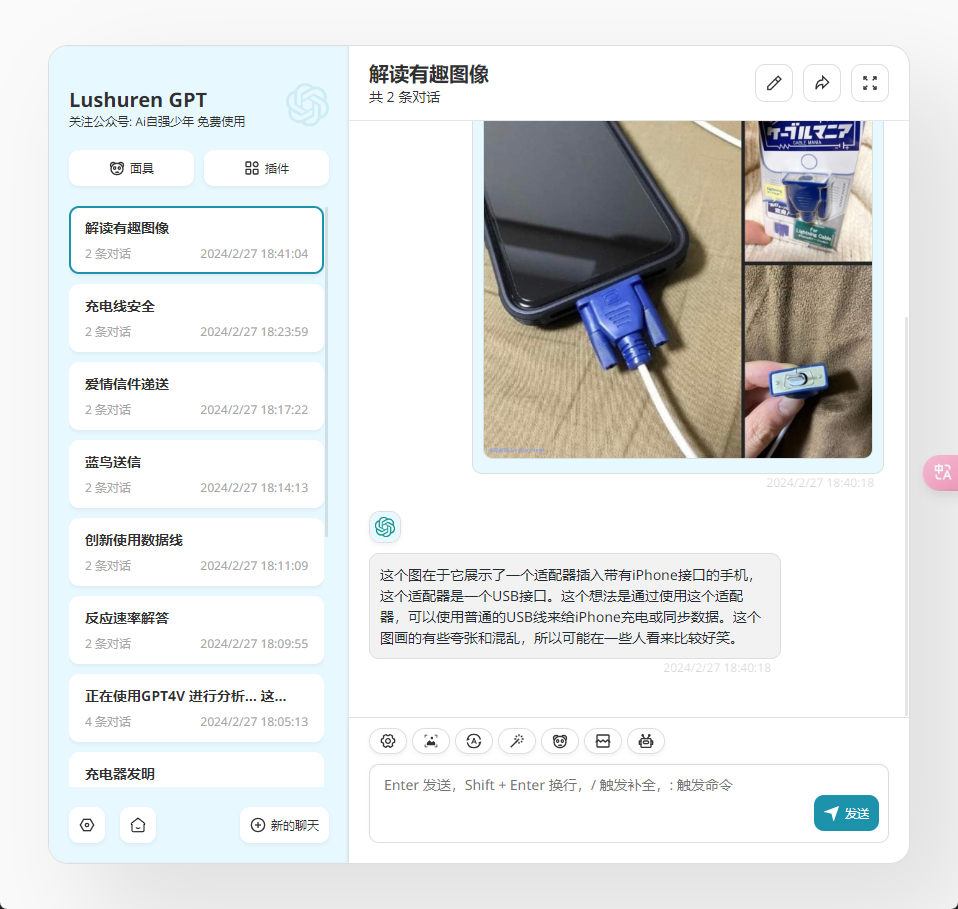

- #### 用LinkReader解析网页
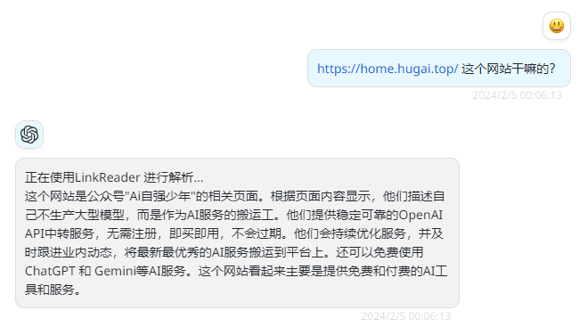

- #### 从wiki百科里搜索信息
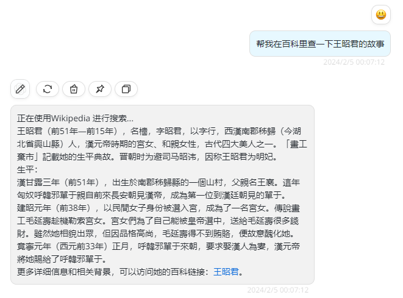

- #### 调用Code Interpreter写python代码
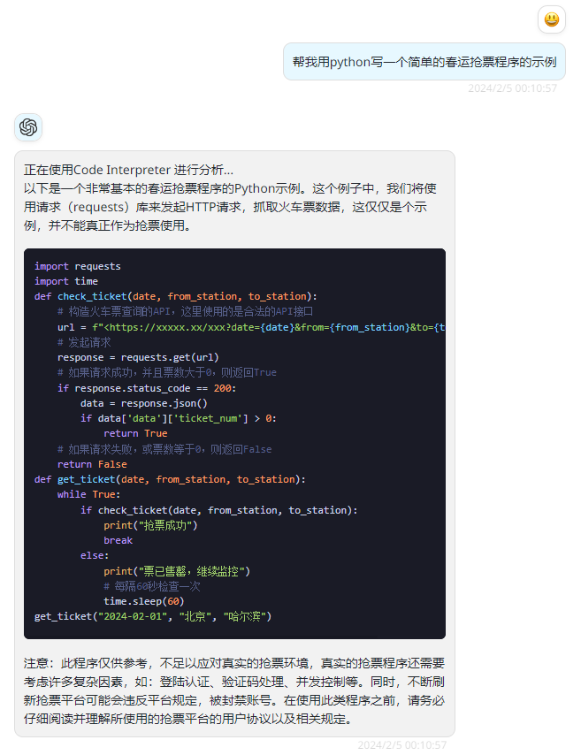

或者你可以直接问鲁树人有哪些技能，然后再决定要不要用这些技能来辅助回答问题：

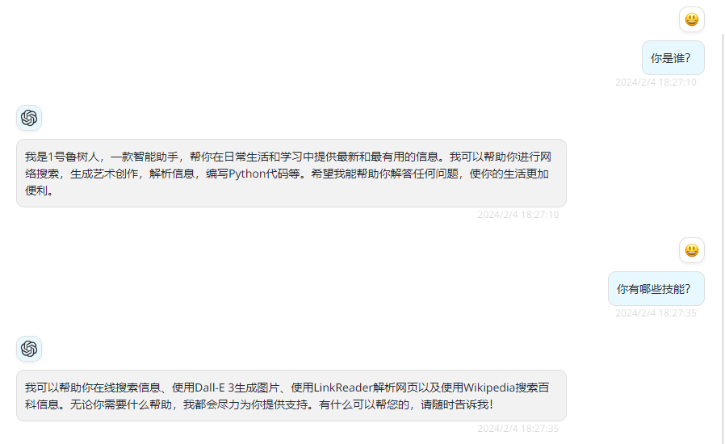

**另外，鲁树人的技能（插件功能）是可以继续扩充的；**

### 2. 可以添加自定义助手

比如最近忙里偷闲，根据身边用户的真实反馈，给鲁树人GPT新增了两个专职小助理：

1. 论文专家：一位卓越的研究文章撰写家，可以根据提供的概要一步步完整地实现用户的论文。

2. 股票分析师：股票分析专家，给用户提供专业的股票市场分析、投资建议和风险评估。

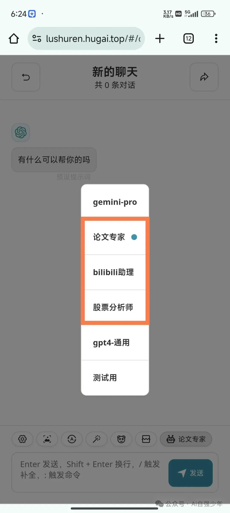

具体用法很简单，就是在下拉模型的地方选择对应的模型就可以了。这样不必研究提示词，对小白用户更加友好。

所以各位在使用过程中，如果有常用的功能需求，可以留言或者私信，我找找有没有现成的插件或者助手，调试好提示词后就可以让鲁树人升级一下。

### 3. 支持Google的Gemini Pro

把模型切换成 gemini-pro，鲁树人就变成Google家的智能助理了：

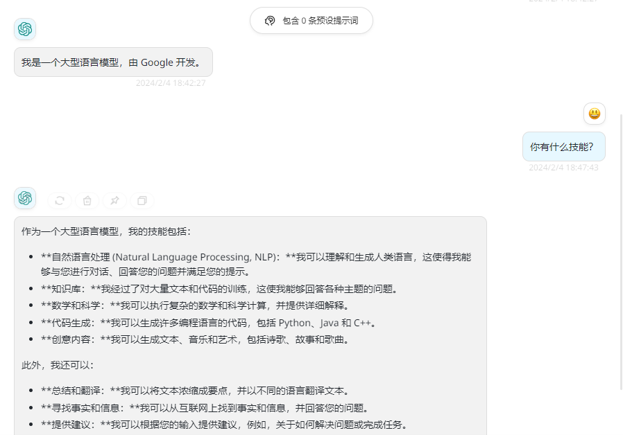

## 如何使用？

登录网页后，按页面上的提示操作即可：

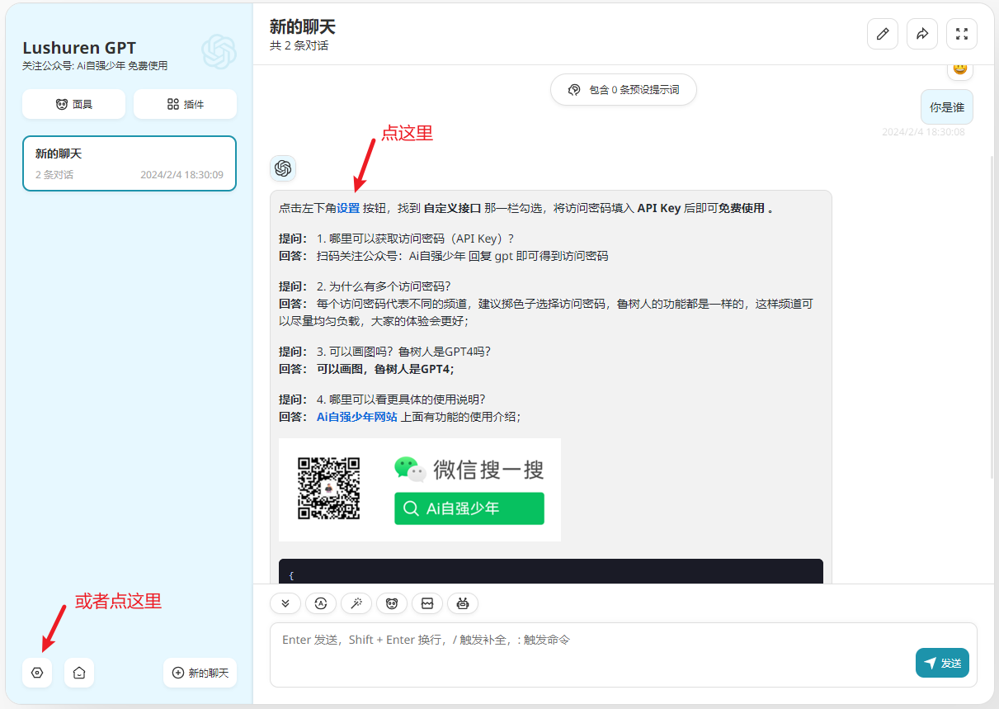

找到访问密码那一栏，把访问密码填入即可，多么熟悉的操作；

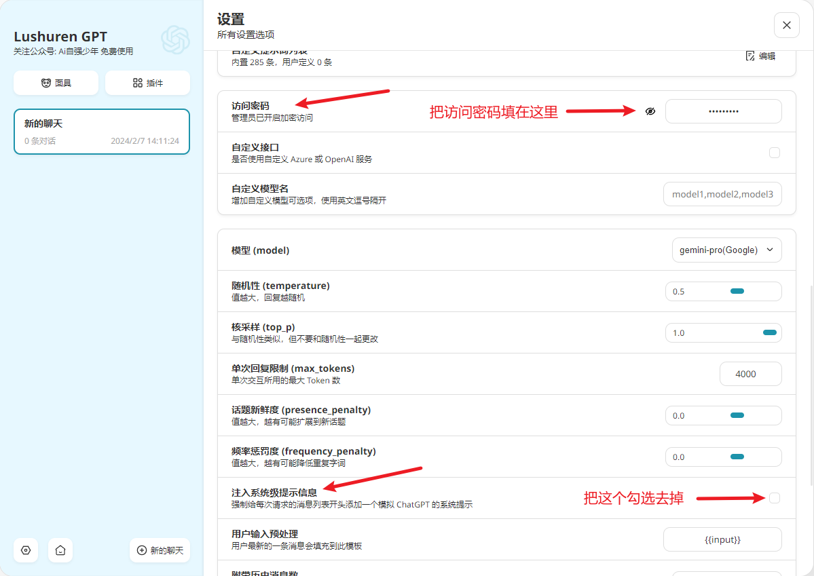

::: tip 提示：
在公众号回复 **gpt** 获得鲁树人的访问密码；

可以在在模型列表中选择你默认使用的模型；

建议把 **注入系统级提示信息** 的勾选去掉，这个会影响自定义模型的使用；
:::

## 为什么可以免费？

这就要讲讲实现原理了。

### 1. 白嫖Coze

字节在海外发布了一个产品叫Coze，免费供大家使用gpt4 和 DALLE 3(国内同款叫"扣子"，但调用的是自家的云雀大模型)；

#### [Coze 是什么？​](https://www.coze.com/docs/zh_cn/welcome.html)

> 官方介绍：Coze 是新一代一站式 AI Bot 开发平台。无论你是否有编程基础，都可以在 Coze 平台上快速搭建基于 AI 模型的各类问答 Bot，从解决简单的问答到处理复杂逻辑的对话。并且，你可以将搭建的 Bot 发布到各类社交平台和通讯软件上，与这些平台/软件上的用户互动。

比如我们的 **鲁树人就是通过Coze发布在Discord平台上的机器人**，在Discord的频道里@鲁树人，他就会自动调用gpt4来回答你的问题。

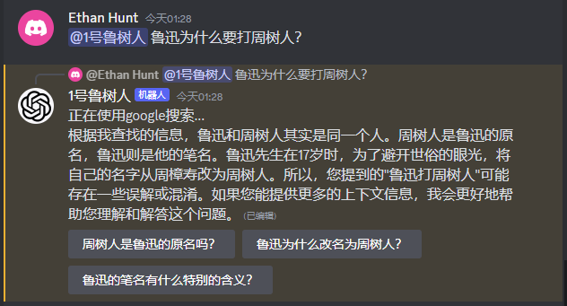

但是国内用不了Discord，怎么办？

这个时候就又有开源大佬出手了🙏，大佬开发了一个[coze-discord-proxy](https://github.com/deanxv/coze-discord-proxy) 代理服务，可以通过接口调用被coze托管的discord-bot。

这样就可以在Discord上先创建一个用户，作为"信鸽"，然后我们在NextChat客户端发消息给"信鸽"，通过信鸽来@鲁树人，然后再把鲁树人的回复返回给NextChat客户端。

给大伙画个简图来说明这个消息传递流程（你说这不是图，我也没办法）：

[客户端](https://lushuren.hugai.top) → [coze-discord-proxy](https://github.com/deanxv/coze-discord-proxy) → Discord的用户 → Coze的鲁树人 → OpenAI

再录个1分钟的小视频，直观展示一下效果吧：

<iframe src="https://lushuren.hugai.top/video/lushurenV1.2-demo.mp4" allow="fullscreen" allowfullscreen="" width="560" height="315" style="border:0"></iframe>

::: tip 注意视频中回复的机器人

我问：你是谁？

**3号鲁树人**出来回答我这个问题；

问：帮我画个去哈尔滨的南方小土豆

**2号鲁树人**帮我画了第一幅图；

追问：我只想要一个土豆，而且要有雪

**6号鲁树人**帮我修改了这幅图；

:::
大家发现没有，有一个鲁树人团队在为各位服务，而且他们彼此知道你前面问了什么，就是说有上下文的记忆能力。

**那么能记住几轮对话呢？**

答案在这里：

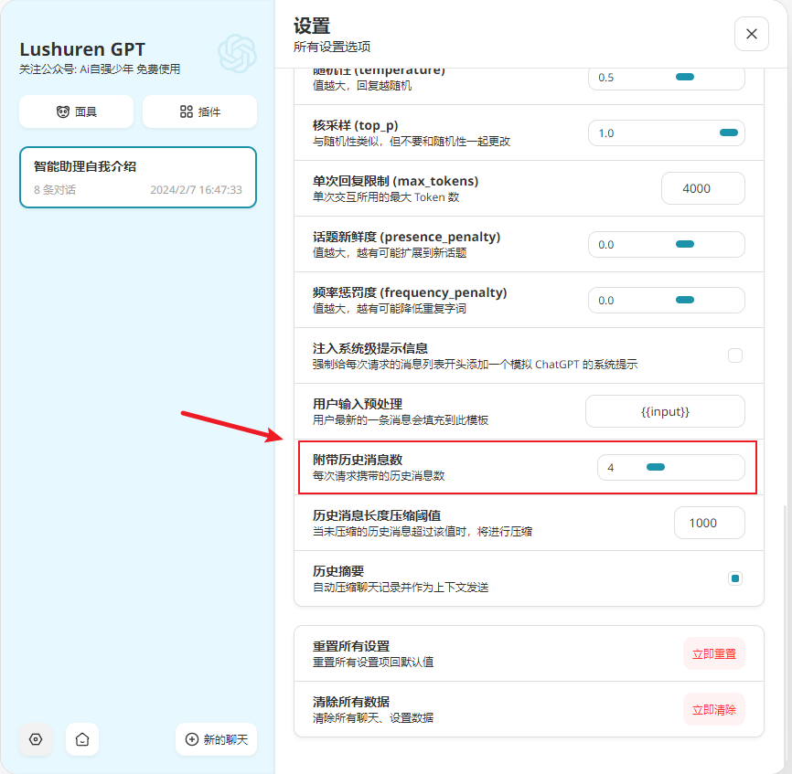

当然，历史消息不可能是无限大的，这几个环节的输入输出都有一定的长度限制，默认4够用啦，而且开得越大，最后接力的鲁树人要处理的信息就更多啦，响应就会变慢，大家自行取舍。

### 2. 免费试用Gemini Pro

Gemini Pro目前是试用的API Key，免费但是有流控：每分钟可以请求60次，即一秒可以问一个问题。

## 使用上有哪些注意事项？

### 1. 插件是否被调用

有时候你可能会希望鲁树人帮你连网搜索，但却发现它并没有这么做，可能是因为你说得**太隐晦**。

对小助理下命令，可以直接一点，比如：**帮我在网上搜索xxx**

当然，在使用插件功能之前，可以先问一下鲁树人：**你有哪些技能**，再针对性地提示，就可以大大提高插件命中率啦。

### 2. 信鸽/插件的调用限制

- **信鸽**
有个用gpt做游戏汉化的朋友，完整测试了24小时，证实了账号用量限制：

  - GPT4(8K)：100次/天
  - GPT4(128K)：50次/天
  - GPT-3.5(16K): 500次/天

一只信鸽根本服务不过来我这近万（四舍五入一下😄）的公众号用户，所以先临时扩充到10只，鲁树人用的是GPT4(8K)这个模型，所以一天的请求上限是1000次，后续根据使用情况再进行扩容。

- **插件**
插件调用有频率的限制，不同插件流控不同，如果出现如下提示，说明流控了，你可以再问一次，系统会自动换信鸽或者鲁树人为你服务。

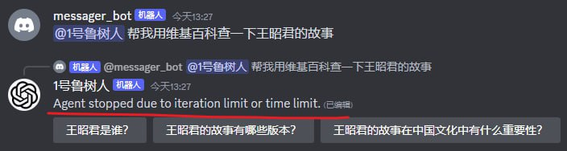

## 后续有什么规划？

**V1.0** 推出得比较急，除了负载能力不行，用户的聊天记录在同一个频道里会串掉。

**V1.1** 没有特别的短板，既解决了上下文记忆的问题，也扩充了负载能力。示意图如下：

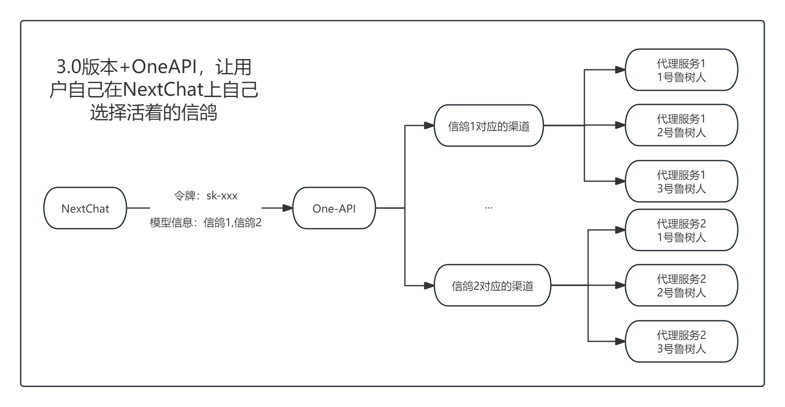

**V2.0** 因为coze限制了机器人@机器人，所以信鸽改为用户本身，并且在后台实现信鸽和鲁树人的负载均衡，对用户透明了，便捷性更进一步。示意图如下：

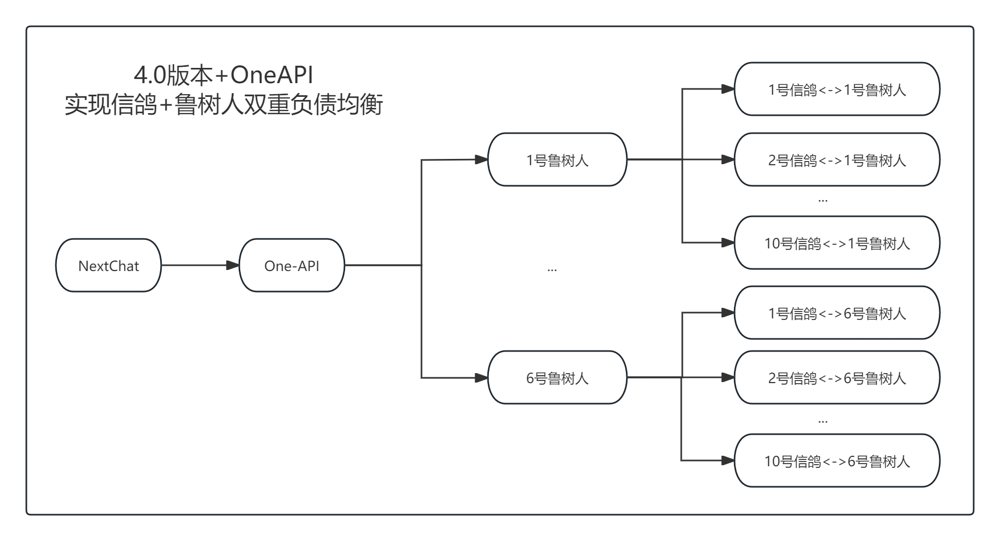

理论上，只要 coze 和 discord 不限制创建机器人的数量，并且保持免费，我的服务器够顶，那就可以不断地扩充我的 信鸽 和 鲁树人 团队，总能满足大家的需求。

Pandora大佬退出之后，原味GPT 和 简洁GPT 已经归档。

免费事业终于后继有人了，😭，都给我😭。

Coze 的可玩性很高，除了支持很多插件之外，还有**工作流，本地知识库，数据库**等等，这些都等着我去继续发掘研究，后续我会多发掘鲁树人本身的能力。

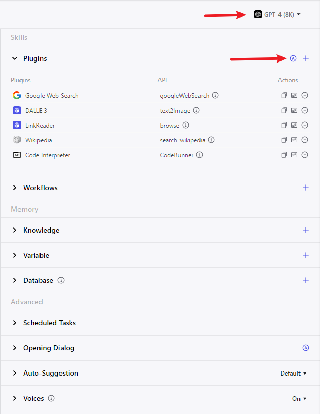

现在，请大家用，狠狠地用，把每天的羊毛薅足，用到字节受不了要收费为止😄。

