# 原味 GPT 介绍 [停服归档]

:::warning 最新动态 2024-01-30
原味 GPT 已停服，原因：[Pandora大佬退出，免费时代落幕](/essay/Pandora-quit.md)
:::

🎉欢迎使用 Ai自强少年 提供的免费 GPT网页服务，本文介绍全新的 原味 GPT。

🎉大家可以直接用 [原味 GPT](https://pandora.hugai.top) 注册ChatGPT账号了，拥有一个自己的账号难度降低`99%` 。

👉访问地址 [原味 GPT](https://pandora.hugai.top)，访问密码 在公众号回复 **gpt** 获得。

💡共享界面有我个人提供的几个免费账号，不注册也可以直接使用。

🚦网络环境：各地网络环境不同，如无法访问则说明缘分未到，不必勉强。若是钢铁般的需求，可以公众号私信联系，我帮你想想办法。

## 这是什么？

由于 OpenAI 对国内用户做了限制，导致国内用户很难轻松使用 ChatGPT 服务，所以有位逆向工程大佬挺身而出，开发了一个 Pandora 项目。

用户通过 Pandora 的服务可以在国内直接使用 OpenAI 官方原版的 ChatGPT。

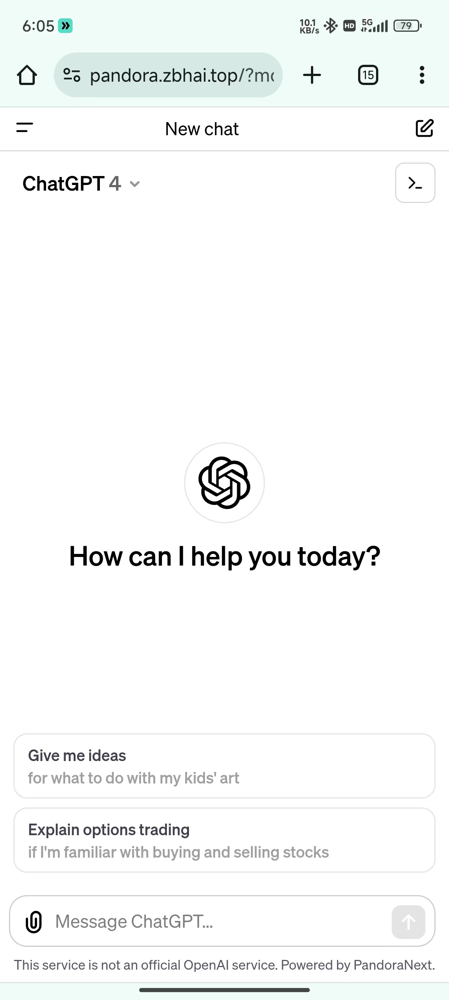

用过就知道，这不能叫模仿，应该说是一模一样。并且大佬还经常把官方暂时隐藏的功能提前放出来(比如 Alpha版本)。

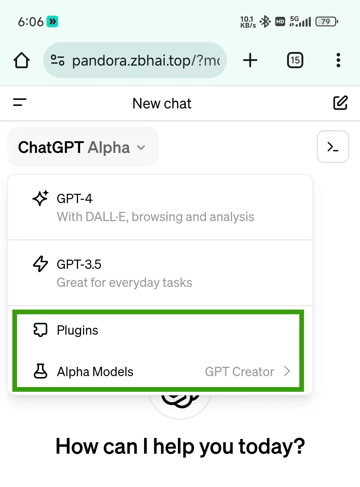

所以群友经常戏称大佬开发新功能之后 OpenAI 才能发布，跟苹果发布会前库克找拼多多进货有异曲同工之妙😜。

我提供的原味 GPT 就是基于 Pandora 项目打造，无需vpn，只需填入访问密码即可免费体验官方 ChatGPT 服务。

## 为什么要提供这个服务？

我经常会被身边的同事，朋友问两个问题：

1. 我想用chatgpt，但我没有账号，怎么办？

2. 有没有稳定的魔法（VPN）推荐？(因为魔法不稳，容易被 OpenAI 封号)

**原味 GPT 可以同时解决上面两个问题。**

没有账号，可以直接注册账号，或者通过我的共享账号直接使用，而且支持每个用户的会话隔离，保证隐私。

有账号的，使用你的个人账号登录。

## 如何使用？

Pandora 的可玩性非常高，为了降低大家的上手成本，目前我仅向大家提供两种最简单的使用方式：

### 1. 如果你没有 ChatGPT 账号

在登录页面直接点 Go shared Chat

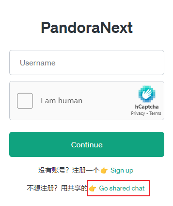

在这个页面，任意选择一个数字进入。

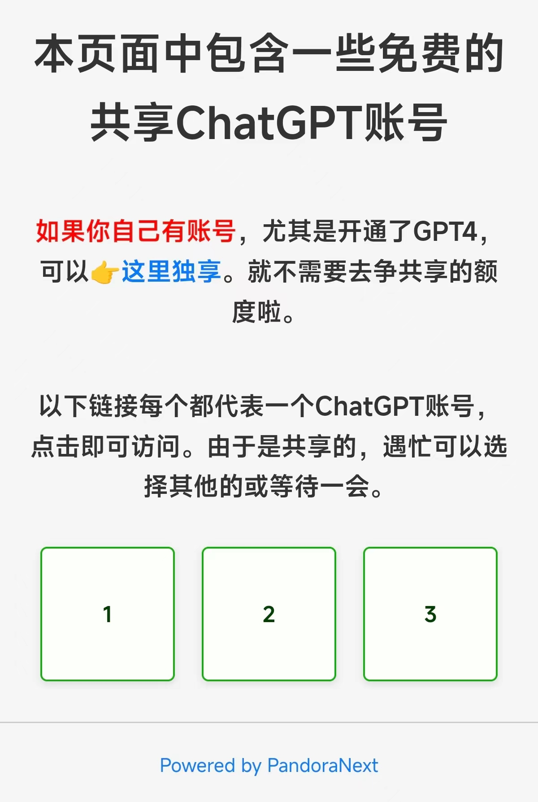

然后设置一个密码，这样你的聊天会话就跟其他用户隔离开了，保证你的隐私。

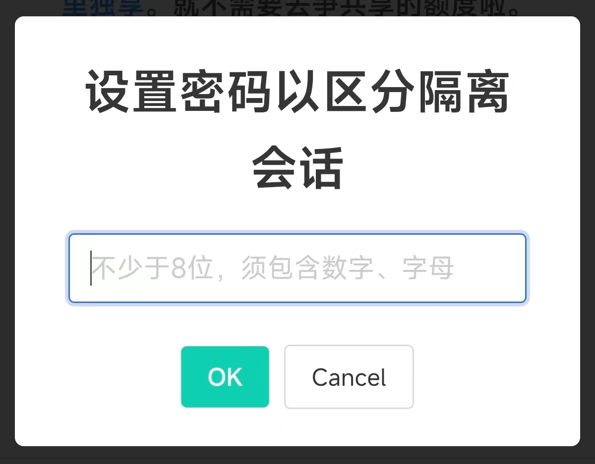

然后就可以进入聊天页面了，很哇塞吧！

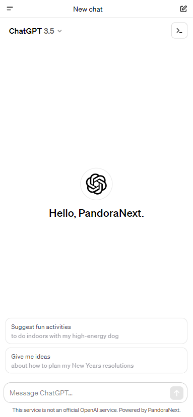

### 2. 如果你想拥有一个自己的 ChatGPT 账号

2.1 在登录页面直接点 Sign up

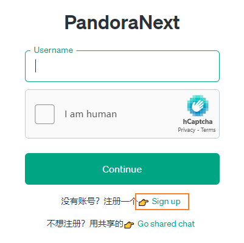

2.2 填写自己的邮箱和密码：

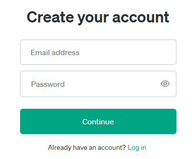

我简单测试了一下，gmail和outlook可以直接注册，而且gmail和outlook通过邮箱别名技巧可以多次注册。

国内邮箱qq.com 126.com 163.com 经测不支持。其他我还没试过，各位自行测试。

2.3 你会看到这样一个页面，用来验证你的邮箱信息。

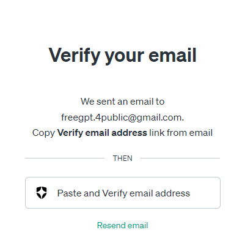

2.4 你会收到一封来自OpenAI的邮件，注意不要直接点验证，国内验证不了。

按钮右键，复制验证邮箱的链接：

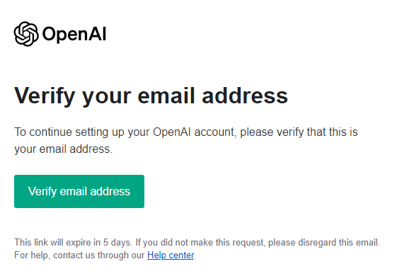

2.5 把复制的邮箱验证地址贴入对话框：

回到 2.3 对应的页面，点击：

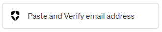

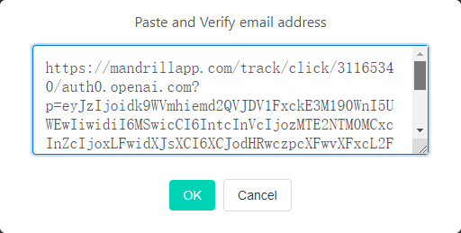

2.6 验证通过之后，给自己起个响亮的名字：

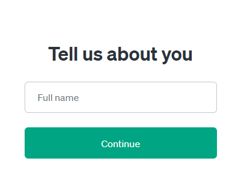

大功告成，从此以后你也有自己的ChatGPT账号了。

**有人要问这跟自己去官网注册有何不同？** 

我高低能给你凑出3条理由：

1. 免梯，这个懂的都懂，不多解释。

2. 不受ip注册数量限制，有时间你无限造。

3. 能装逼。（其实这一条就够了）

    --by Pandora 大佬：我秦始皇

### 3. 如果你有 ChatGPT 账号

尤其是每个月 $20 的 Plus账号，直接用你的账号密码登录即可。

为了保证安全，我在登录页面增加了一个简单的验证码，得先确保你是咱们人类同胞，才能继续进行登录。

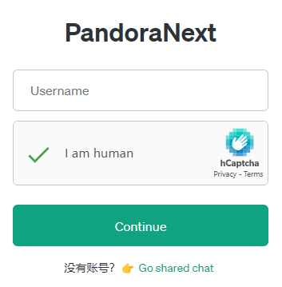

当然，不管你有没有账号，在第一次访问我的这个网页时都需要填入一个密码

**在公众号聊天窗口回复 gpt 就可以获得。**

## 为什么可以免费？

Pandora大佬提供的服务是有流量上限的。

目前根据 github 账号的注册年限来分配每天的用量，我目前一天可以有 9000 条对话，第一次体验到年龄大的优势。。。

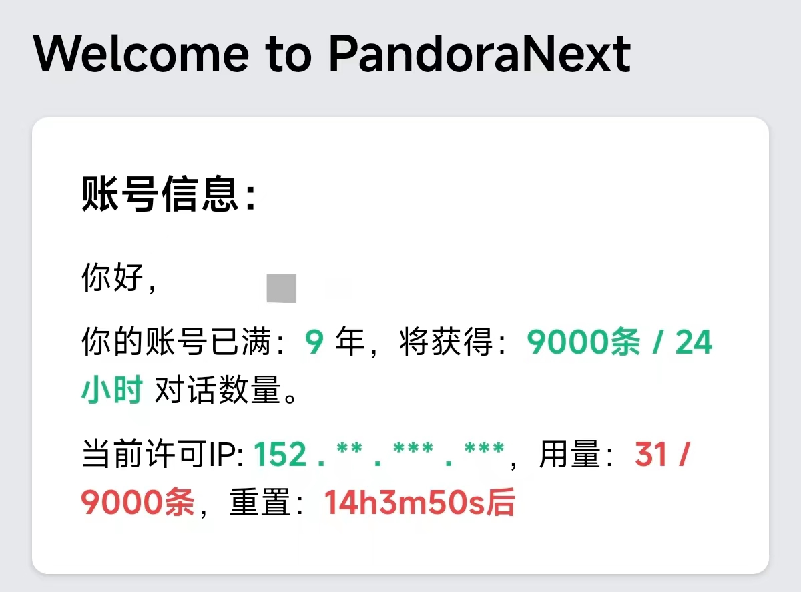

我这种高频用户日常使用就 50-100 条对话。之前我的预判是：在保证用户体验的前提下，这辆车最多也就容纳 180 人，所以之前还花了两周整了个白名单功能，现在发现是个伪需求。

1. 大部分人没有账号，也非高频用户，只是想体验一下；

2. 能搞定Plus账号的，连美元支付都行，会魔法是理所当然的，也不需要我这个通道；

另外，目前日均对话条数6000左右，还"养得起"各位，所以暂不设置门槛，供大家免费使用。

当然，每个月服务器，域名的成本是客观存在的，以前靠各位读者的赞赏补贴，后面公众号还上了生产力板块，这部分有一点点收入，刚刚好能覆盖整个公众号的现金支出，自给自足了。

## 使用上有哪些注意事项？

1. 可用性：这个服务可用，需要同时满足我提供的客户端服务，Pandora的逆向服务，OpenAI的官方服务 三者都正常才行。

所以我贴心地在导航栏准备了一个[状态监控](https://status.hugai.top) 界面，如果出现持续性的报错，无响应，请先查看免费服务监控状态。

如果你是用账号密码登录，还需要保证你的账号可用才行。

2. 在享受免费服务的同时，请大家遵守OpenAI的内容政策，我不想再收到OpenAI的警告邮件，不要做出会影响到公众号正常运营，损害大家利益的事情，高抬贵手朋友们🤷。

3. 建议接触并尝试使用 ChatGPT ，它是所有人的外挂。

最后， Pandora 项目还有很多功能特性，只是有些门槛比较高，怕把你们整不会了就没放出来。

我被问得多了，就先出这么一个方案，后面等我研究得更深入些再优化吧。

原作者在不断地更新版本，我也会不定期跟进。持续关注 Ai自强少年 的朋友应该能看到，我们的各项服务一直在进化，也欢迎大家转发给需要的朋友们😄。

