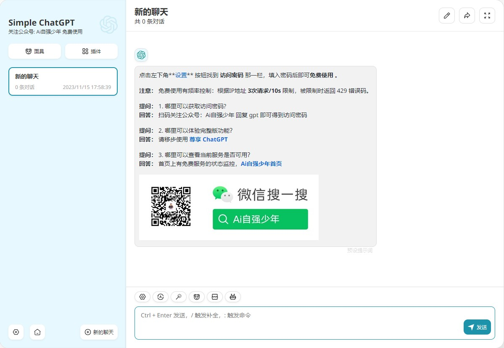
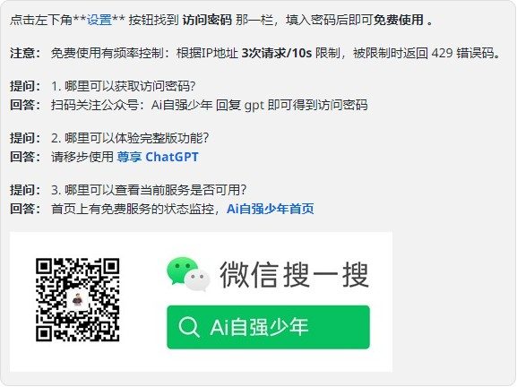
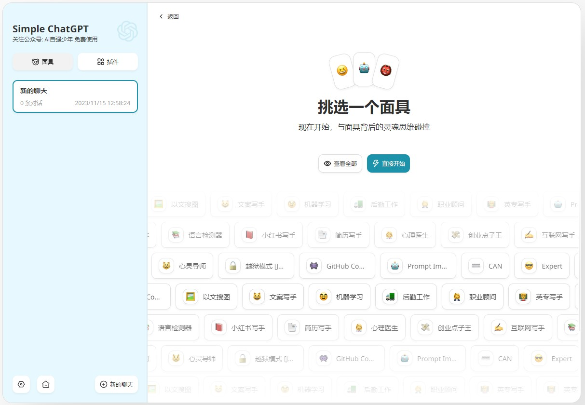
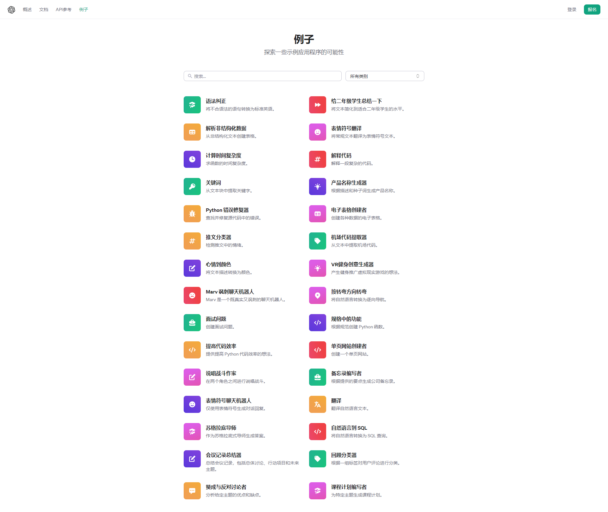
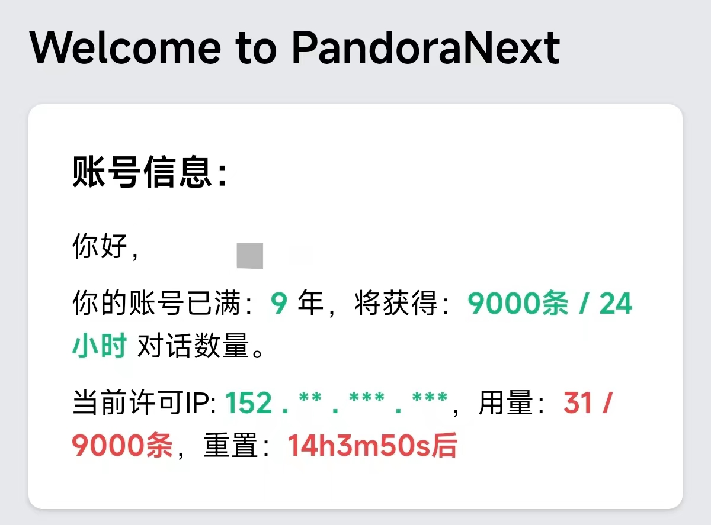
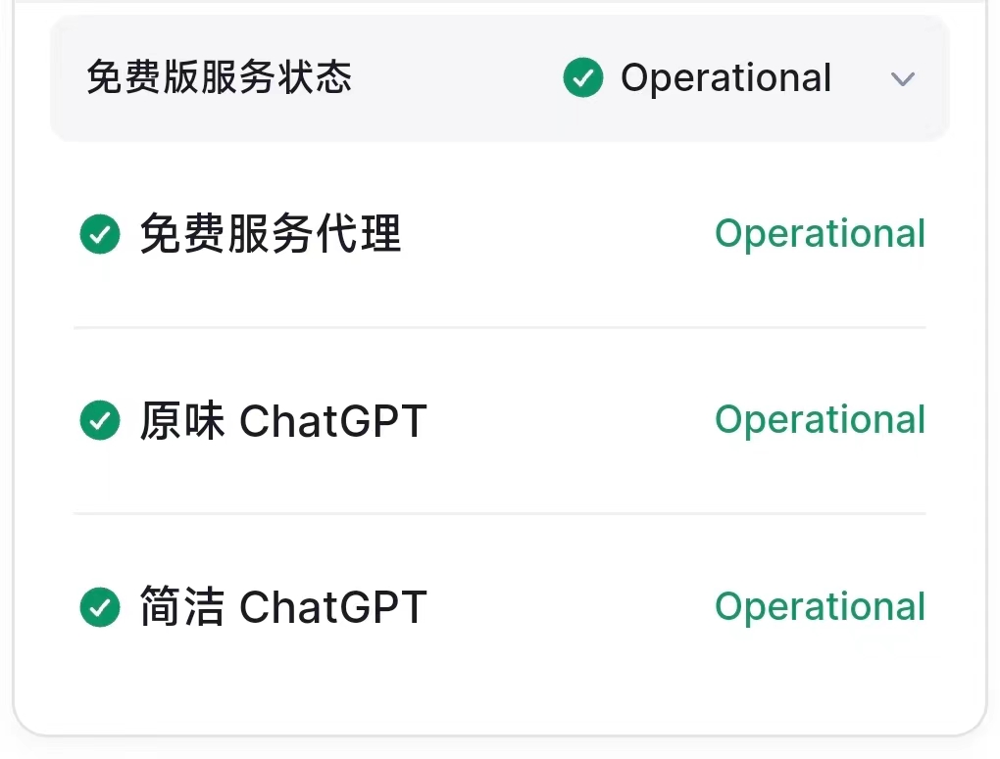

# 简洁 ChatGPT 介绍

🎉欢迎使用 Ai自强少年 提供的免费 ChatGPT网页服务，本文介绍全新的 [简洁版ChatGPT](https://simple.hugai.top)。

👉访问地址[简洁ChatGPT](https://simple.hugai.top), 访问密码 在公众号回复 **gpt** 获得。

💡想体验完整版功能，请移步使用公众号生产力板块：[尊享ChatGPT](https://next.hugai.top)。

🚦网络环境：各地网络环境不同，如无法访问则说明缘分未到，不必勉强。若是钢铁般的需求，可以公众号私信联系，我帮你想想办法。

## 这是什么？

由于 OpenAI 对国内用户做了限制，导致国内用户很难轻松使用 ChatGPT 类服务，所以催生出很多第三方开发者自行实现的的聊天软件，比如：

- ChatBox

- ChatGPT Next Web

- ChatGPT Web

我们提供的 简洁 GPT 就是其中一个，基于开源项目ChatGPT Next Web打造，无需魔法，无需ChatGPT账号，只需填入访问密码即可免费使用。

## 如何使用？

首先，公众号聊天窗口回复 **gpt** 就获得访问密码。

然后，在侧边栏左下角点设置按钮，找到 **访问密码** 那一行填入即可。

这个就是设置按钮👇

## 有哪些特色功能？

自定义面具。每个面具代表一类角色，系统已经内置一部分，可以先行体验。

熟练之后，可以自定义面具，比如网上自己找提示词，打造自己的小助理团队。可以[参考OpenAI官方的例子](https://platform.openai.com/examples)：

## 为什么可以免费？

后台走的是Pandora大佬提供的代理服务，一个基于AccessToken 逆向成OpenAI Key的项目。

通俗解释，这里一样是用的官网的ChatGPT聊天服务，只不过前端页面不同。

**但大佬提供的代理服务是有流量上限的**。

目前根据 github 账号的注册年限来分配每天的用量，我目前一天可以有 9000 条对话，第一次体验到年龄大的优势。。。

当然，每个月服务器，域名的成本是客观存在的，以前靠各位读者的赞赏补贴，后面公众号还上了生产力板块，这部分有一点点收入，刚刚好能覆盖整个公众号的现金支出，自给自足了。

## 使用上有哪些限制？

1. 模型：免费版本只支持 gpt-3.5-turbo。

2. 如果想使用gpt4，传图片，语音等完整功能，请移步 [尊享 GPT](https://next.hugai.top)。

3. 如果想免费使用官方原版ChatGPT，请移步 [原味 GPT](https://pandora.hugai.top)。

4. 可用性：这个服务可用，需要同时满足我提供的客户端服务，Pandora的免费代理服务，OpenAI的官方服务 都正常才行。

所以我贴心地在 [首页](https://home.hugai.top) 准备了一个[状态监控](https://status.hugai.top) 界面，如果出现持续性的报错，无响应，请先查看免费服务监控状态。

