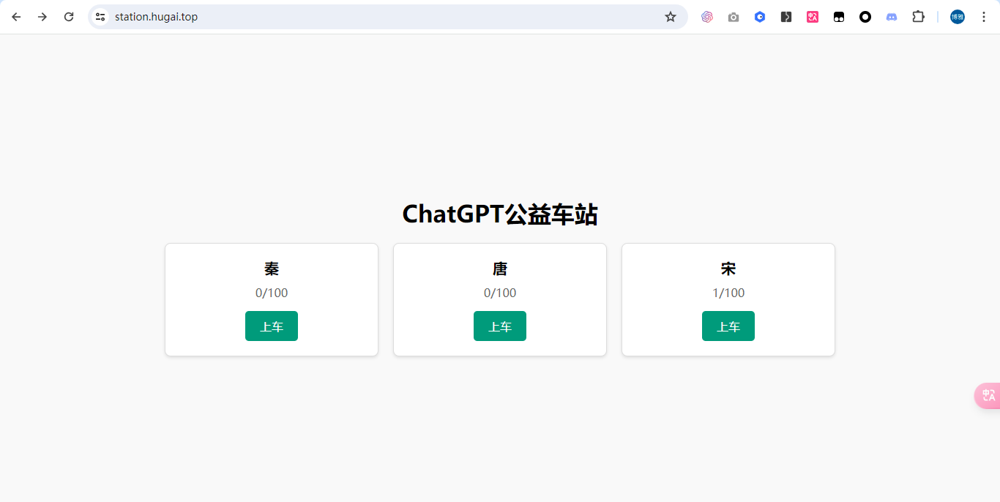
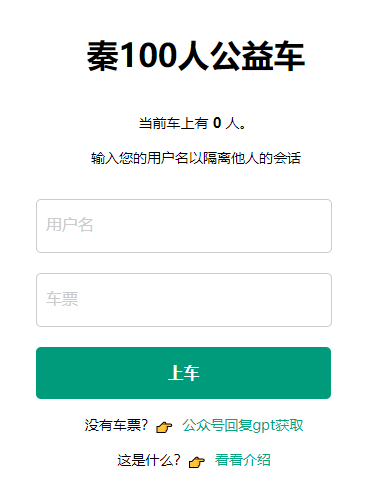
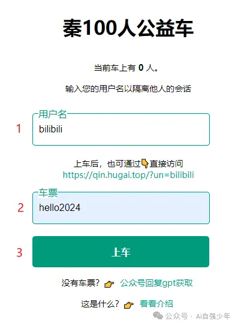
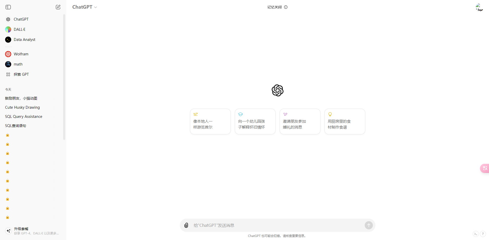
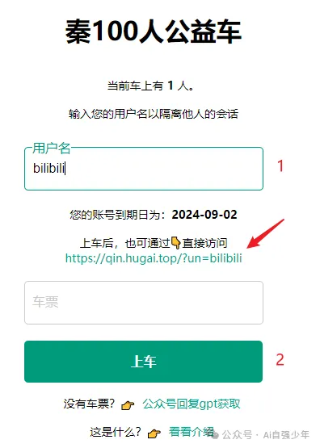

# ChatGPT 公益车站

🎉欢迎使用 Ai自强少年 提供的 ChatGPT 公益车站。

👉访问链接：[ChatGPT 公益车站](https://station.hugai.top)；

👉上车的车票，**请在公众号回复 gpt 获取**。

🚦网络环境：请在外部浏览器打开链接，微信可能屏蔽了本站域名。。。

## 这是什么？

简单说就是国内可以直接访问的 Chatgpt 官方镜像。

上个月我搞了个[chatgpt plus 的拼车服务](/productivity/plus.md)，很可惜，秦二世而亡。

但整个服务的框架还在，于是我稍微改造一下，给大家免费提供**普通账号的镜像服务**，同时为了方便后面车队扩容，我弄了个极其精简的车站页面，统一展示所有车辆信息。

目前有王朝车队共三辆车，每辆车负载100人，后续看使用情况扩容：

现在搞公益事业都有门槛了，如果只是支持gpt-3.5-turbo的话我都不愿意折腾，因为用处不大。

上周OpenAI 已经将最新的gpt-4o 在网页端免费对公众（不包括中国）开放了，所以我觉得有分享的意义了。

## 如何使用？

::: tip 太长不看版

1. 打开公益车站，你将看到这样一个页面：

2. 选择一辆人少一点的车，点上车进入具体的车辆页面；

3. 填入你的用户名 和 车票，点上车即可；

4. 后续使用，直接凭用户名上车即可，无需填车票；

5. 页面上会根据用户名生成你的专属链接，可直接访问。

:::

### 1. 如果你是第一次上车

你需要同时填写 用户名 和 车票，然后点击上车按钮即可。

通过验证之后，你就会进入这个跟官方无限接近的页面，畅享官方服务：

**用户名**：由你自定义，既是账号，也是密码。

它的作用有二：

- 用于会话隔离，每个用户只能看到自己的聊天记录，其他用户的内容是一把🔒，保证隐私。

- 生成你的专属链接，可以分享给你的亲朋好友直接使用。

::: tip 提示

用户名最好是：你能轻易记住，又不容易被别人猜到，长度在6位以上。

第一次登录后，系统会记录你的用户名，后续直接输入用户名，点上车即可；

车票就是你的一次性上车凭证，在公众号回复 gpt 获取。
:::

### 2. 如果你已经上过车了

日常使用，有两种快速登录的方式。

#### 2.1 在车辆页面登录

此时，你只需要填写 用户名 ，然后点击上车按钮即可。（不必填车票）

填写用户名1秒后就能看到**你的账号到期日**。

每天系统会查看是否有到期的乘客，到期了会自动请乘客下车。

为了让后来的朋友有机会上车，**每次上车的时长为3个月**，到期了重新填写车票上车即可；

#### 2.2 通过专属链接直接使用

举例说明，你的用户名是bilibili，那么就可以通过页面上生成的专属链接👇：

https://qin.hugai.top/?un=bilibili

直接访问。

泰裤啦！

## 使用的注意事项

- 可用性：这个服务可用，需要同时满足我提供的域名服务，“始皇”的逆向服务，OpenAI的官方服务 三者都正常才行。如果出现持续性的报错，无响应，请在公众号私信我，帮自己也是帮大家。

- 普通帐号使用 gpt-4o 和 gpts 是有额度限制的,用完了等一等。

- 在享受拼车服务的同时，请大家爱惜车辆，务必遵守OpenAI的内容政策，尤其是**不要搞黄色，不要搞黄色，不要搞黄色**。封号就翻车了，损害大家利益的事情不要做，高抬贵手朋友们🤷。

- 不同的车之间没有区别，只是名字不同，方便我个人维护罢了。

最后，如果觉得这个事情对你有帮助，或者能帮助到你的朋友，求个免费的转发或者在看，不急于现在，你用它三个月，三个月后再分享也成。