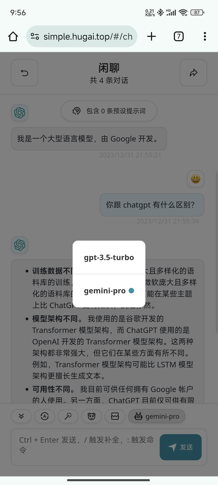
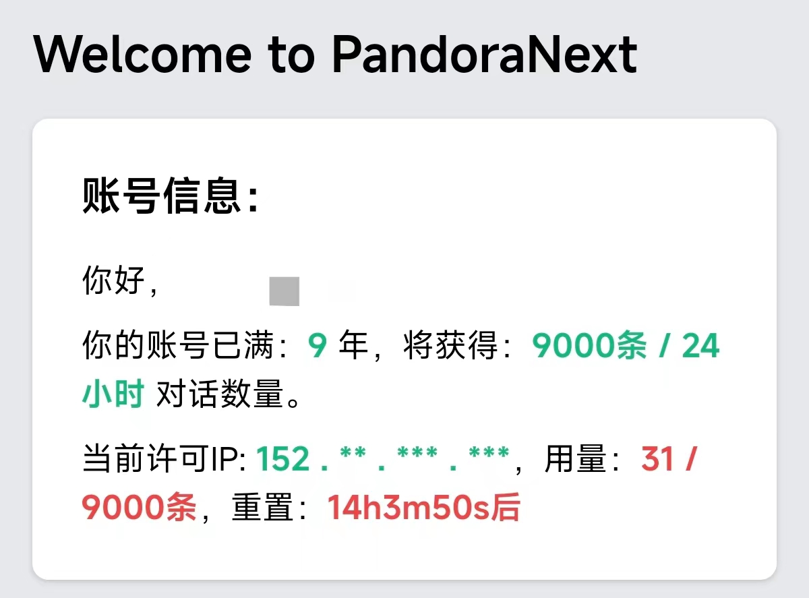

# 简洁 GPT

:::warning 最新动态 2024-01-30
简洁 GPT 已停服，原因：[Pandora大佬退出，免费时代落幕](/essay/Pandora-quit.md)
:::

🎉欢迎使用 Ai自强少年 提供的 **免费** ChatGPT网页服务，本文介绍全新的 [简洁GPT](https://simple.hugai.top)。

🎉[简洁 GPT](https://simple.hugai.top) 现在同时支持OpenAI的gpt-3.5-turbo 和 Google的Gemini Pro啦。

👉访问地址[简洁 GPT](https://simple.hugai.top), 访问密码 在公众号回复 **gpt** 获得。

💡想体验完整版功能，请移步使用公众号生产力板块：[尊享 GPT](/productivity/next.md)。

🚦网络环境：各地网络环境不同，如无法访问则说明缘分未到，不必勉强。若是钢铁般的需求，可以公众号私信联系，我帮你想想办法。

## 这是什么？

由于 OpenAI 对国内用户做了限制，导致国内用户很难轻松使用 ChatGPT 类服务，所以催生出很多第三方开发者自行实现的的聊天软件，比如：

- ChatBox

- ChatGPT Next Web

- ChatGPT Web

我们提供的 简洁 GPT 就是其中一个，基于开源项目ChatGPT Next Web打造，无需魔法，无需ChatGPT账号，只需填入访问密码即可免费使用。

## 如何使用？

首先，公众号聊天窗口回复 **gpt** 就能获得访问密码。

然后，在侧边栏左下角点设置按钮，👉 

找到 **访问密码** 那一行填入即可，然后就可以愉快地聊天了。

你可以在聊天界面自行选择OpenAI的**gpt-3.5-turbo** 或者 Google的**gemini-pro**，都是**免费**的哦。

## 为什么可以免费？

- **gpt-3.5-turbo** 后台走的是Pandora大佬提供的代理服务，一个基于AccessToken 逆向成OpenAI Key的项目。

    通俗解释，这里实际用的还是官网的ChatGPT聊天服务，只不过前端页面不同。

    **但大佬提供的代理服务是有流量上限的**。

    目前根据 github 账号的注册年限来分配每天的用量，我一天可以有 9000 条对话，第一次体验到年龄大的优势。。。

- **gemini-pro** 目前用的就是我个人的Google API Key。

    免费但是有流控：每分钟可以请求60次，即一秒可以问一个问题。

    

当然，每个月服务器，域名的成本是客观存在的，以前靠各位读者的赞赏补贴，后面公众号还上了生产力板块，这部分有一点点收入，刚刚好能覆盖整个公众号的现金支出，自给自足了。

所以我现在是把这部分服务当作公益事业，希望能帮助更多朋友接触AI，体验AI带来的效率提升。

## 什么是面具？

面具 = 多个预设提示词 + 模型设置 + 对话设置。

**预设提示词（Contextual Prompts）** 一般用于让 ChatGPT 生成更加符合要求的输出，也可以增加系统约束或者输入有限的额外知识。

**模型设置** 则顾名思义，使用此面具创建的对话都会默认使用对应的模型参数。

通俗地讲，**每个面具代表一类角色**，系统已经内置一部分，可以先行体验。

熟练之后，可以自定义面具，比如网上自己找提示词，打造自己的小助理团队。可以[参考OpenAI官方的例子](https://platform.openai.com/examples)：

## 使用上有哪些注意事项？

1. 模型：免费版本只支持 gpt-3.5-turbo(OpenAI) 和 gemini-pro(Google)。

2. 如果使用gemini-pro(Google)，建议在设置页面中关闭**注入系统级提示信息**，否则gemini-pro会以为它也是ChatGPT，让它扮演它自己吧。。。

3. 如果想使用gpt4，传图片，语音等完整功能，请移步 [尊享 GPT](https://next.hugai.top)。

4. 如果想免费使用官方原版ChatGPT，请移步 [原味 GPT](https://pandora.hugai.top)。

5. 可用性：这个服务可用，需要同时满足我提供的客户端服务，Pandora的免费代理服务，OpenAI的官方服务 都正常才行。

    所以我贴心地在导航栏 准备了一个[状态监控](https://status.hugai.top) 界面，如果出现持续性的报错，无响应，请先查看免费服务监控状态。

6. 在享受免费服务的同时，请大家遵守OpenAI 和 Google的内容政策，我不想再收到警告邮件，不要做出会影响到公众号正常运营，损害大家利益的事情，高抬贵手朋友们🤷。

