# OpenAI API 中转服务
:tada:欢迎使用 Ai自强少年 提供的中转 API 服务 Hai API，本服务旨在为大家提供稳定的 OpenAI API 中转服务。

::: tip 最新动态 2023-11-08
已支持 gpt-4-1106-preview，gpt-3.5-turbo-1106 。

价格已经调整为与官网一致。

gpt-3.5-turbo 模型已自动映射为 gpt-3.5-turbo-1106。

gpt-4-vision-preview 仍在开发中，敬请期待。
:::

⚠️gtp-4-turbo 的额度消耗速度是 3.5 的 10 到 20 倍，单次聊天最高可能会消耗高达数万 token，请谨慎使用。

💡网页版体验入口：[尊享ChatGPT](https://next.hugai.top) ，中转地址：**`https://api.hugai.top`**(备用中转地址：**`https://api-proxy.hugai.top`**)，哪个快用哪个，请搭配密钥使用。

🚦网络环境：各地连接速度不同，如无法访问说明缘分未到，不勉强；若是钢铁般的需求，请在微信公众号私信联系。

## 这是什么？

由于 OpenAI 对国内用户做了限制，导致国内用户很难轻松使用 ChatGPT 类服务，很多基于 ChatGPT 的聊天软件，比如：

- ChatBox

- Sider

- ChatGPT Next Web

- ChatGPT Web

- AMA

- 沉浸式翻译

- 虚拟桌宠模拟器

- 以及各种各样的浏览器扩展

同时大模型开发使用的 langchain、llamaindex 等库，往往需要用户传入 OpenAI API Key，但在很多情况下，国内的网络状况都不允许直连 api.openai.com （OpenAI 的 API 地址），所以我推出了此中转服务，它的特点：

- 稳定：我应该不会轻易跑路，毕竟这玩意儿也赚不了几个钱，只是用于维持公众号的日常运营；

- 方便：所有用到 OpenAI API 的地方都可以无缝替代；

- 快速：我会持续优化中转服务的线路速度，来保证使用体验；

- 省心：没有包月，没有会员，没有限时，用多少买多少，不用担心过期。

## 为什么要提供这个中转服务？

我在公众号上提供的两个免费项目 [原味ChatGPT](https://pandora.hugai.top) 和 [简洁ChatGPT](https://simple.hugai.top) 吸引了不少用户。然而，随着项目的功能稳定，来自文章的赞赏日益减少，而服务器，域名，网络都是需要持续投入的。

所以决定再为有API使用需求的用户们提供官方 OpenAI API 中转服务，这样大家无需折腾繁琐的 OpenAI 账号注册和缴费流程，就能用与官方相同的价格使用 ChatGPT API。

## 如何购买？

点击链接 [Ai自强少年的小店](https://shop.zhongzhuanyong.fun) ，选择对应Token额度的Key购买即可：

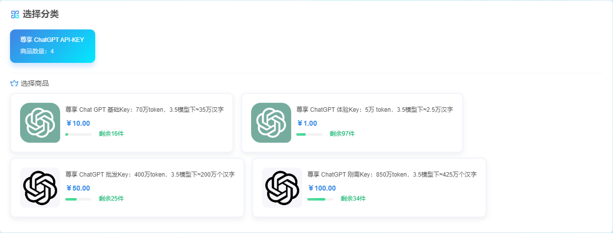

点击链接 [Key查询及充值页](https://usage.hugai.top) ，将购买的Key填入，可以用量情况及响应速度：

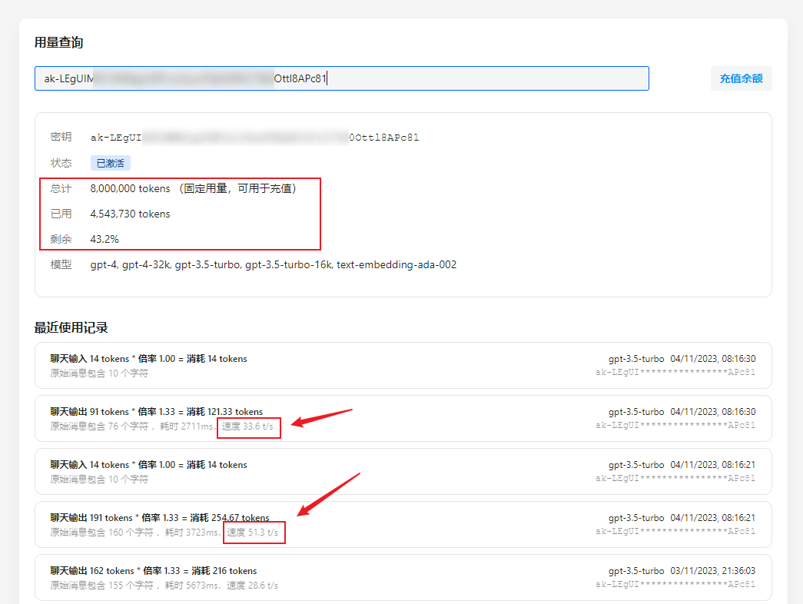

## 如何使用？

在付款之后，可以订单页或者您预留的邮箱中找到刚刚买到的 API Key，搭配中转地址，即可无缝替代 OpenAI 官方 API。如果你是开发者，请查阅 OpenAI 官方 API 文档：

[platform.openai.com](https://platform.openai.com/docs/api-reference/completions/create)

使用时将官方文档中所有的 `https://api.openai.com` 替换为本服务提供的中转地址：**`https://api.hugai.top`** 或备用地址：**`https://api-proxy.hugai.top`**

接口用法与 OpenAI 官方 API 完全一致。

目前已经支持的中转接口如下：

```TypeScript
export const OpenaiPath = {
  ChatPath: "v1/chat/completions", // chatgpt 聊天接口
  UsagePath: "v1/dashboard/billing/usage", // 用量查询，数据单位为 token
  SubsPath: "v1/dashboard/billing/subscription", // 总量查询，数据单位为 token
  ListModelPath: "v1/models", // 查询可用模型
  EmbeddingPath: "v1/embeddings", // 文本向量化
};
```

在开始使用之前，你需要用到以下信息：

```Plain Text
中转接口地址：https://api.hugai.top/openai
中转 API Key：ak-xxxxxxxxx
```

### 在 尊享ChatGPT 中使用

我们以 尊享ChatGPT 的演示站点为例，点开链接：[尊享 ChatGPT](https://next.hugai.top)

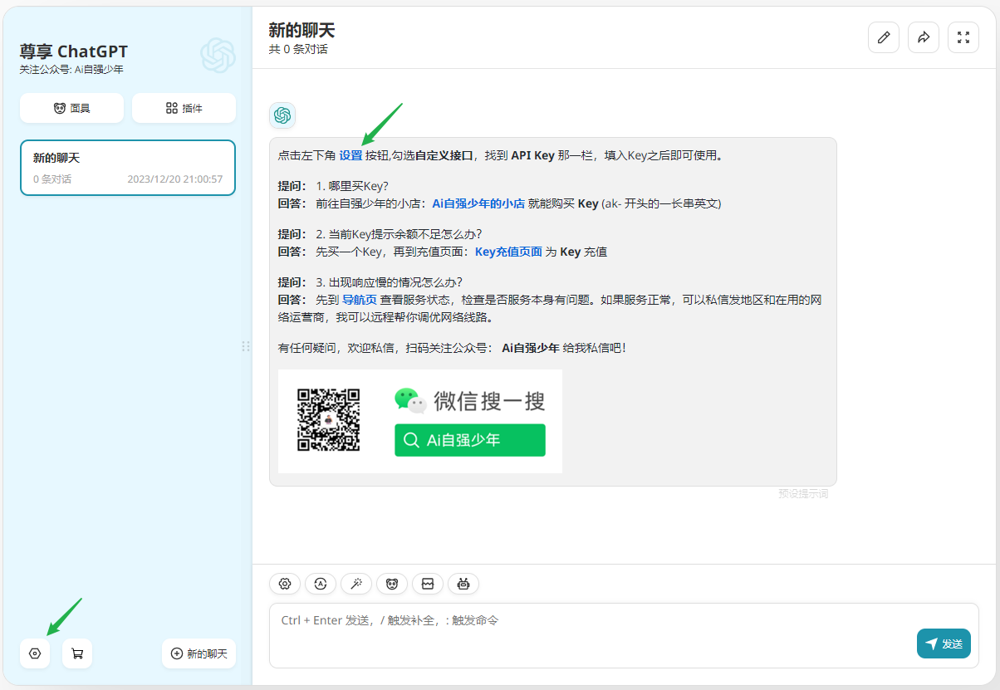

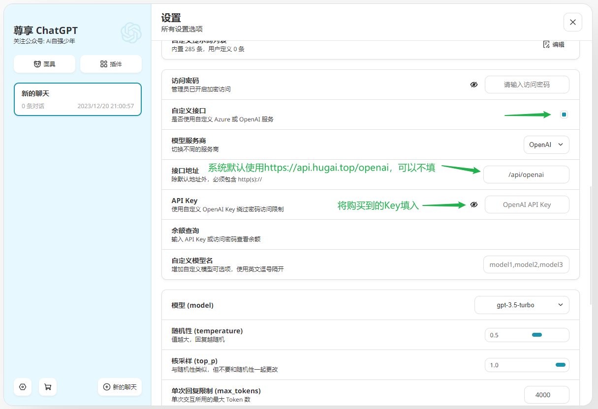

然后点击重新检查，即可开始使用。

### 在官方 openai 库中使用

```Python
import openai

openai.api_base = "https://api.hugai.top/openai/v1"
openai.api_key = "ak-3133f6*******ee269b71d"

chat_completion = openai.ChatCompletion.create(
    model="gpt-3.5-turbo", messages=[{"role": "user", "content": "ping!"}]
)

print(chat_completion.choices[0].message.content)
```


- **支持gpt4：**

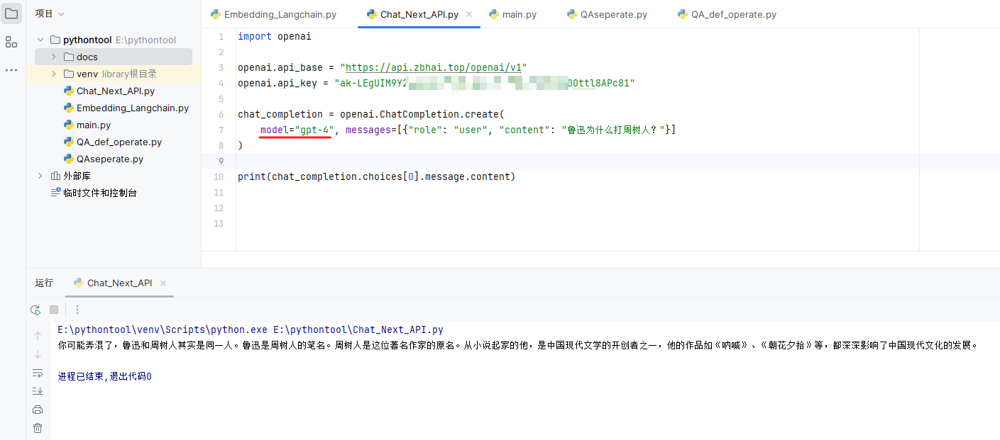

- **支持text-embedding-ada-002：**

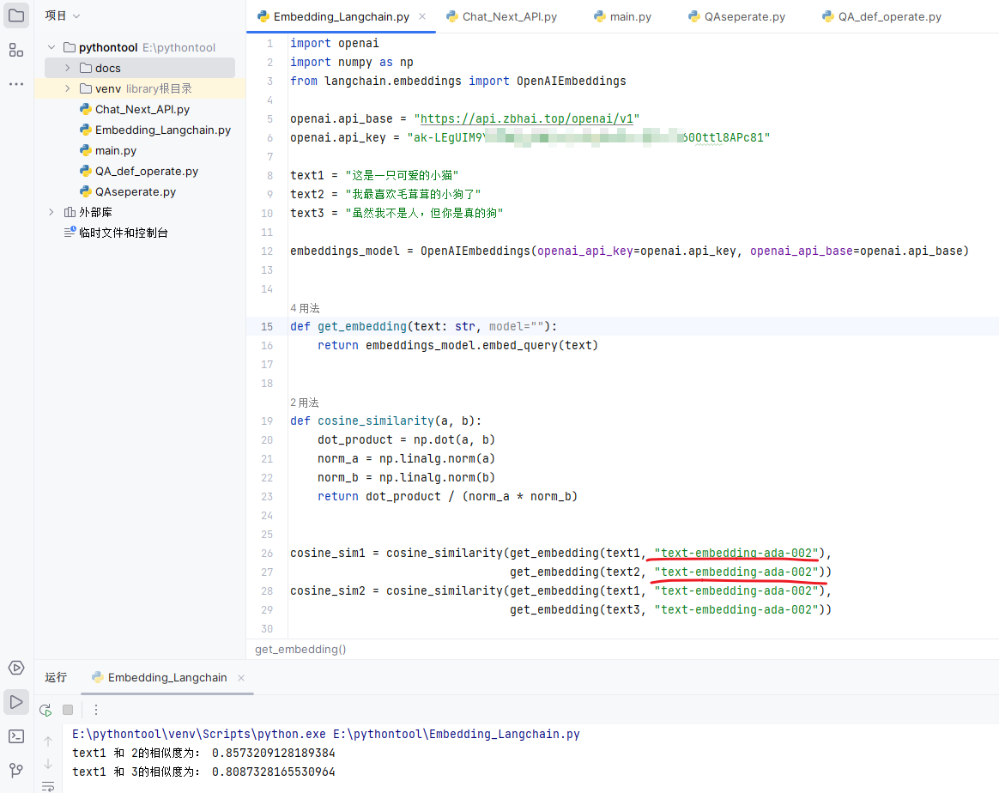

### 在 LangChain 中使用

```Python
from langchain.chat_models import ChatOpenAI

llm = ChatOpenAI(
    openai_api_base="https://api.hugai.top/openai/v1", # 注意，末尾要加 /v1
    openai_api_key="ak-3133f******fee269b71d",
)

res = llm.predict("hello")

print(res)
```

### 在虚拟桌宠模拟器中使用

使用下方地址作为 API URL，API Key 使用 ak- 即可。

```Plain Text
https://api.hugai.top/openai/v1/chat/completions
```

### 在沉浸式翻译中使用

使用下方地址作为 API URL，API Key 使用 ak- 即可。

```Plain Text
https://api.hugai.top/openai/v1/chat/completions
```

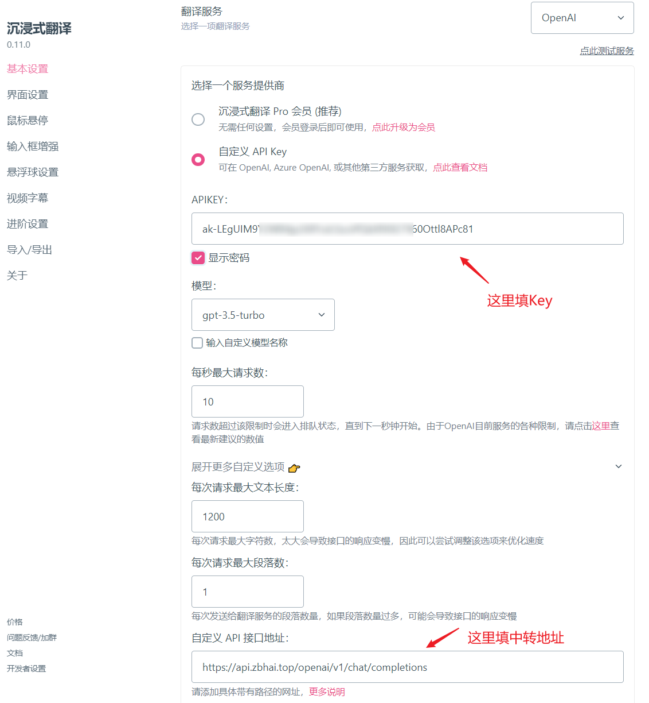

### 其他终端的使用方式遇到了再补充。

## 定价规则

### 什么是 token？

Token 是大语言模型处理信息的最小单元，它介于“字”和“词”之间，你可以用下方的网址，来计算一段文字会变成多少 token：

[gpt-tokenizer playground](https://gpt-tokenizer.dev/)

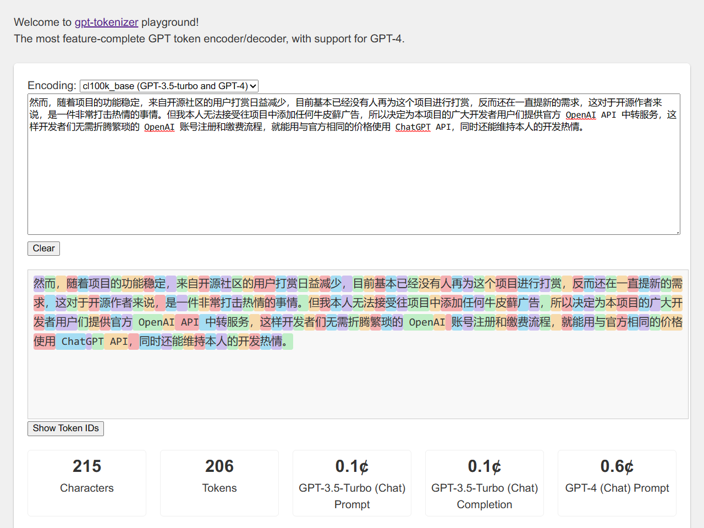

大部分情况下，你都可以使用 1 汉字 = 2 token 来近似估算中文聊天的中文所需 token 数。

### 定价规则

OpenAI 官网给出的定价：[Pricing](https://openai.com/pricing)

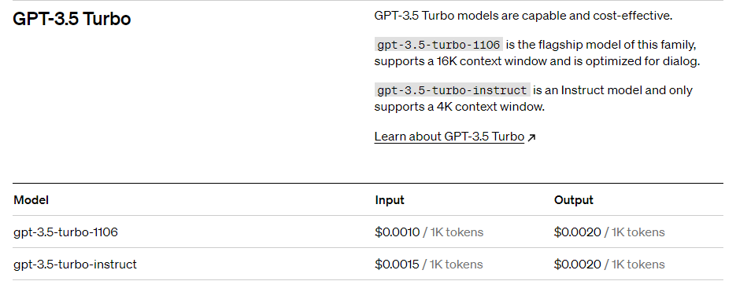

以大家最常用的GPT-3.5 Turbo 为例，每1000 tokens(约500个汉字) 的输入为 $0.001, 输出为 $0.002。

而最新的GPT-4 Turbo，每1000 tokens(约500个汉字) 的输入为 $0.01, 输出为 $0.03。

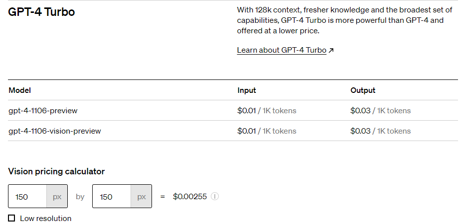

我们以GPT-3.5 Turbo为定价基准，你所购买到的 token 数，都是以GPT-3.5 Turbo 的输入 token 为计价基准。

这样当你使用GPT-4 Turbo 模型时，输入为3.5 消耗tokens数x10倍（$0.01/$0.001），输出为3.5 消耗tokens数x30倍。

而最早的GPT-4 的相对来说就非常贵了，gpt-4 是GPT-3.5 Turbo 的30倍，gpt-4-32k 是60倍，不推荐使用。 

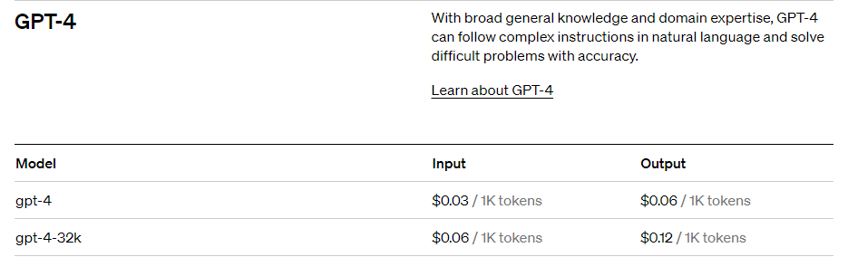


## 常见问题

### 为什么 gpt-4-turbo 额度消耗这么快？

- gpt-4-turbo 的消耗速度是 gpt-3.5-turbo 的 10 到 20 倍，假设购买了 5w token(1块钱)，我们用 15 倍作为平均倍率，也就是 50000 / 15 = 3000 字左右，加上每次要附带上历史消息，能发的消息数将会进一步减半，在最极限的情况下，一篇长文章就能把 5w token 消耗完，所以请谨慎使用。

### 使用 尊享 ChatGPT 时，有哪些节省 token 的小技巧？

- 点开对话框上方的设置按钮，找到里面的设置项：

    - **携带历史消息数**：数量越少，消耗 token 越少，但同时 gpt 会忘记之前的对话

    - **历史摘要**：用于记录长期话题，关闭后可以减少 token 消耗

    - **注入系统级提示词**：用于提升 ChatGPT 的回复质量，关闭后可减少 token 消耗

- 在对话时，点击对话框上方的机器人图标，可以快捷切换模型，可以优先使用 3.5 问答，如果回答不满意，再切换为 4.0 重新提问。

### 如何快速知道当前聊天的模型？

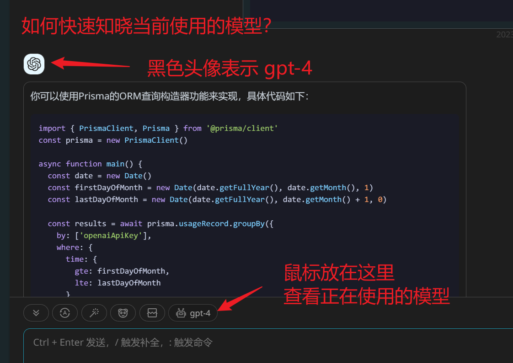

## 用户协议

付款即视为同意本协议！否则请不要付款！

1. 本服务不会以任何形式持久化存储任何用户的任何聊天信息；

2. 本服务不知晓也无从知晓用户在本服务上传输的任何文本内容，用户使用本服务引发的任何违法犯罪后果，由使用者承担，本服务将全力配合由此可能引起的相关调查；

3. 用户在平台上的任何付款行为，均视为对公众号运营的捐赠行为，并不与本服务构成交易，也不存在任何法律意义上的合同或契约关系；

4. 本服务视为开源项目 ChatGPT Next Web 项目以及相关项目的辅助调试工具，请勿用于其他用途；