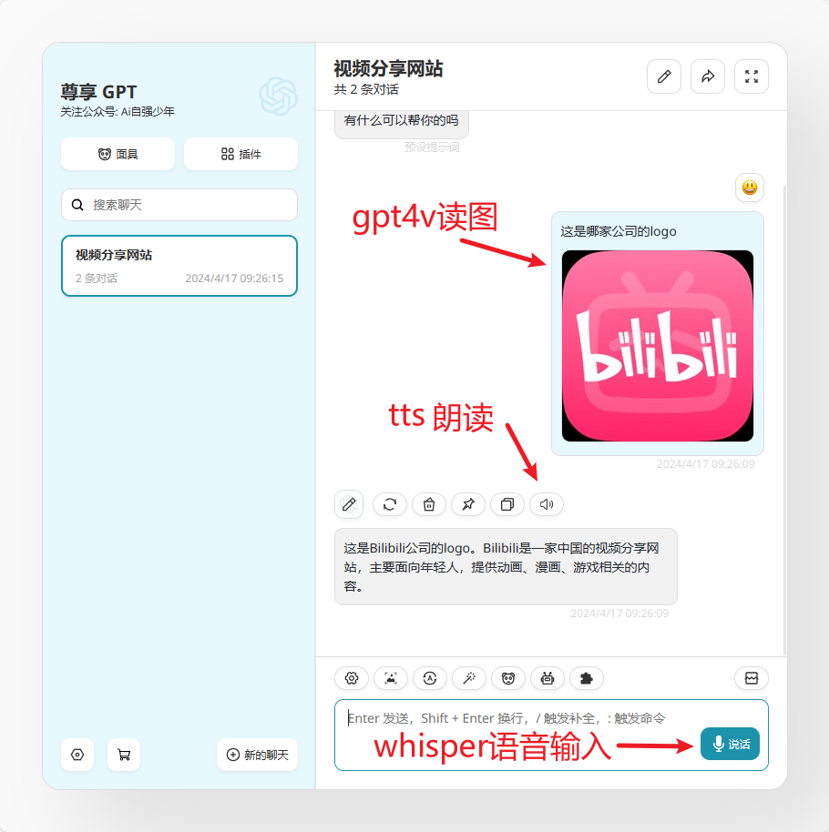
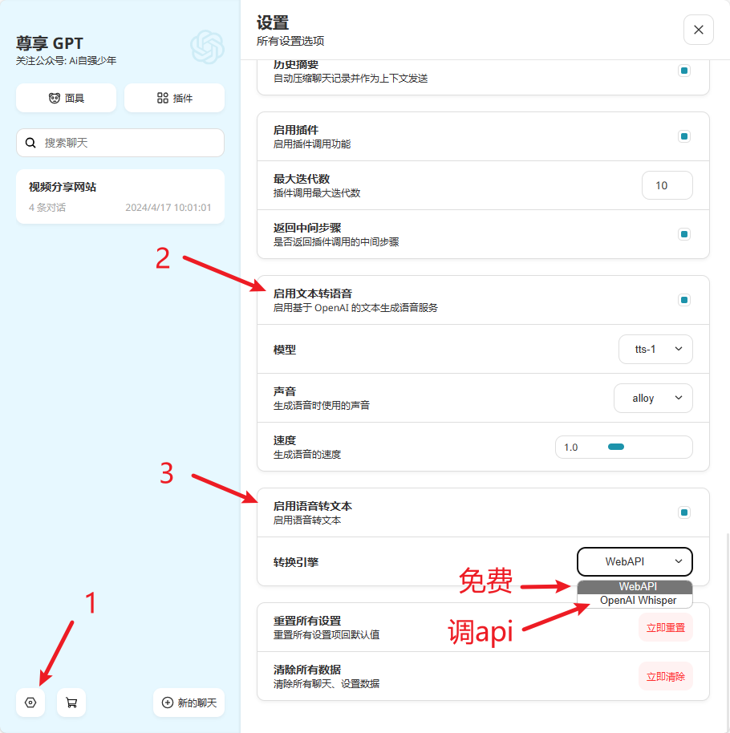
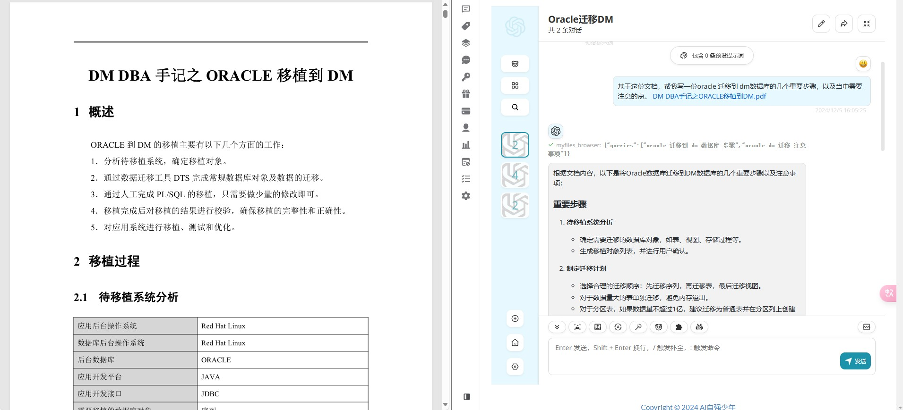
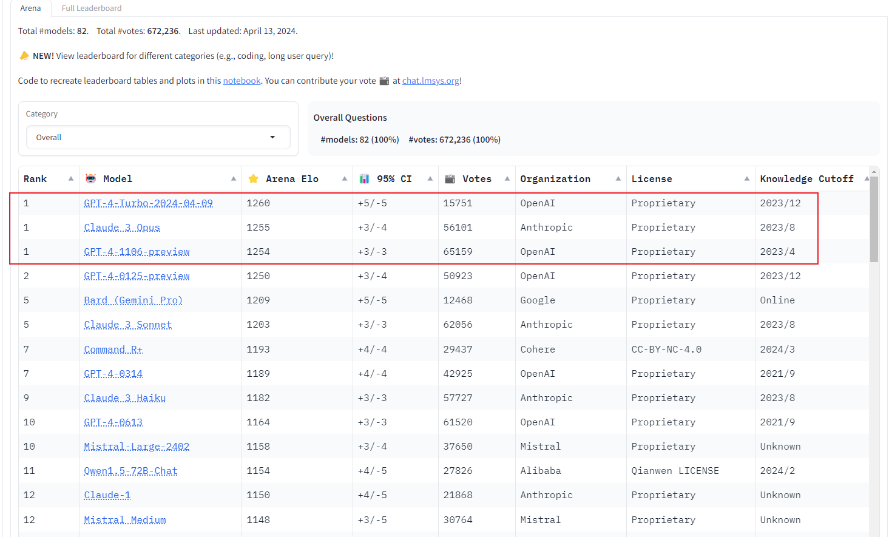
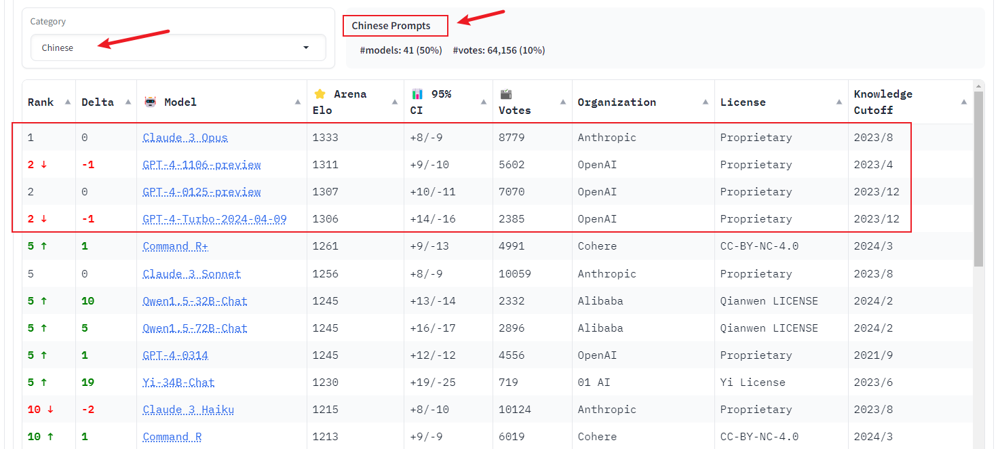

# 尊享 GPT

🎉欢迎使用 AI自强少年 提供的生产力 ChatGPT类网页服务：尊享 GPT。

::: tip 最新动态 2024-12-05
- 支持RAG文件上传功能
- 支持OpenAI最新的：o1-preview 和 o1-mini；
- 支持Anthropic最新的：claude-3.5-sonnet-20241022, claude-3.5-haiku-20241022；
:::

👉访问方式：先打开[OneAPI 中转服务](https://one-api.aiporters.com/)，从侧边栏的 **聊天** 找到 [尊享 GPT](https://next.aiporters.com/)，点击进入即可。

<video src="https://wehugai.com/images/chat_entry.webm" controls width="800" height="450"></video>

🚦网络环境：请在外部浏览器打开链接，微信可能屏蔽了本站域名。如果响应速度慢或者打不开，请参考 [当你无法访问本站服务](/tips/cloudflare-speed.md);

## 尊享GPT有什么能力？

### 1.支持全系OpenAI模型

包括最新的多模态gpt-4o，画图的dalle，语音输入的tts 和 语音输出的whisper。

语音输入和输出，需要在设置页面打开：

### 2.支持插件功能

当前支持的插件包括：

  1. 搜索引擎：支持联网搜索

  2. 计算器：用于计算数学表达式

  3. 网页浏览器：从网页中提取信息或总结其内容

  4. 维基百科：从维基百科获取数据

  5. PDF浏览器：从pdf文件的url中提取文档信息或总结内容

  6. WolframAlpha：回答有关数学，科学，技术，文化，社会的问题

  7. DALLE3

#### 插件功能使用示例

- DALLE3画图

- 联网搜索，使用的搜索引擎是地表最强的那个：

- PDF浏览器, 目前仅支持从pdf文件的url中提取文档信息或总结内容，不能直接上传pdf。

::: warning 提醒
pdf文档通常很大，解析pdf的内容需要不少时间，所以使用这个插件响应会慢，需要耐心。
:::

- 网页浏览器：从网页中提取信息或总结其内容

- 维基百科：有啥不懂的可以问问百科全书

- WolframAlpha：回答有关数学，科学，技术，文化，社会的问题，功能强大，对搞学术的朋友比较有用

- 在同一个聊天窗口，插件可以组合使用，GPT 真的聪明

### 3.支持RAG文件上传功能

RAG(Retrieval Augmented Generation) 检索增强生成是一种赋予生成式人工智能模型信息检索能力的技术。它通过修改与大型语言模型（LLM）的交互，使该模型在响应用户查询时参考指定的文档集，并利用这些信息来增强从自身庞大的静态训练数据中提取的信息。

最常见的应用，就是上传文档，然后大模型就可以检索你本地上传的文档内容了，基于文档来回答你的问题。

放个效果图：

目前支持的文件类型：
- txt
- md
- pdf
- docx
- csv
- json
- srt
- mp3 (基于OpenAIWhisper)

支持的最大文件大小：10M

因为我申请的免费数据库最多只能存500M啦，试试水先。。。

#### 为什么要接入Anthropic家的 claude-3系列？

在OpenAI最新的gpt-4-turbo-20240409发布之前, Anthropic 的claude-3-opus 曾一度打败gpt4夺得全球最强大模型的称号；

主要参考的也是这份榜单: [LMSYS 聊天机器人竞技场排行榜](https://chat.lmsys.org/?leaderboard)

而当我们把分类聚焦到中文提示词的时候，会发现**claude-3-opus 依旧是中文环境下的最强大模型**：

我的理念就是为各位搬运**最新，最top的大模型服务**，所以Claude-3-opus不能错过。

## 如何使用？

### 太长不看版

1.打开One API 中转服务地址：[https://one-api.aiporters.com/](https://one-api.aiporters.com/)

2.注册账号后，登录系统，进入总览页面，新用户有 $0.1 的体验额度。

3. 选择一条令牌，点击聊天，跳转至尊享GPT聊天面板。或者，直接在左边的侧边栏，找到聊天菜单，点击尊享GPT 也OK。 👇

<video src="https://wehugai.com/images/chat_entry.webm" controls width="800" height="450"></video>

## 什么是插件？

"GPT" 是 "Generative Pre-trained Transformer" 的缩写，翻译成中文就是“生成式预训练变换器”，通过使用大量的文本数据进行预训练，学习了语言的结构和用法，使其能够生成、理解和回应人类语言。

**所以当前的GPT相当于一个静态的程序，并且只擅长处理文字。**

比如gpt-4-1106-preview 的训练数据截止到2023年4月；而gpt-3.5-turbo 知识截止2021年9月。

那我想跟大模型交流最近发生的事情怎么办？配套的插件便应运而生。

首当其冲的就是联网搜索的插件，GPT发现自己的知识库中不包含这类信息时，会主动去网上搜内容，然后再回答你的问题。

以此类推，大模型不擅长画图，所以就有了DALLE这种文生图的插件。当然DALLE本身是一个文生图的大模型，只是当它被ChatGPT调用时，你可以理解为一个外部插件。

**插件就是为了补充GPT不擅长的领域，我们提供了一堆工具给GPT使用，扩充它的能力范围，以更好地满足我们的需求。**

## 插件功能如何使用？

::: tip 建议
用插件的时候，模型选择最新的；

**是否调用插件以及什么时候调用插件是由 GPT 自己决定的**，插件返回结果后再由 GPT 合并上下文信息，回答用户的问题，同样的工具给更聪明的模型用可以带来更好的效果。

而如果想触发一些插件可以在 prompt 中进行引导，比如：帮我在网上搜索xxx、使用wiki查找xxx、计算xxxxx等等，大家自行体验。
:::

### 1. 在插件列表页，将常用的勾选上

### 2. 在聊天窗口打开插件开关(默认是打开的)

## 常见问题

### 如何快速知道当前聊天的模型？

### 为什么使用插件时返回结果不固定，偶尔甚至无响应？

1. 是否调用插件，什么时候调用插件，传什么信息给插件都是由 GPT 自己决定的，插件返回结果之后也是GPT结合上下文再给回答的，因为GPT的回答本身就存在随机性，所以返回结果不固定。

2. 为了保证插件的效果，最好使用gpt-4 或 gpt-4 turbo模型 ，如gpt-4-1106-preview，更聪明，也更精确，gpt-3.5-turbo存在杜撰的可能性。

3. 不同的插件对应不同的三方服务接口，从插件调用到结果返回，服务器需要同时与插件接口和OpenAI交互，客观上就会慢，并且如果网络还出现波动，可能就会无响应了。

### 为什么吐字时快时慢，甚至偶尔无响应呢？

这个服务的可用，同时满足我提供的客户端服务，One API中转服务，官方的OpenAI API 服务 都正常才行,目前看还是很稳的。

所以我贴心地在 导航栏 准备了一个[状态监控](https://status.hugai.top) 界面，如果出现持续性的网络波动，无响应，请先查看服务监控状态（不含插件服务）。

