# 尊享 GPT 介绍

::: tip 写在开始之前
如果您只是想体验gpt-4(OpenAI) 或者 画图功能 或者 gemini-pro(Google), 那可以直接用 [鲁树人GPT](https://lushuren.hugai.top)，而且是**免费**的，无需使用尊享版。
:::

🎉欢迎使用 Ai自强少年 提供的生产力 ChatGPT网页服务：尊享 GPT ，本文仅介绍与简洁 GPT有差异的部分。

::: tip 最新动态 2024-01-05
支持一批三方插件，目前直接可用的包括：
- 搜索引擎：支持联网搜索
- 计算器：用于计算数学表达式
- 网页浏览器：从网页中提取信息或总结其内容
- 维基百科：从维基百科获取数据
- PDF浏览器：从pdf文件的url中提取文档信息或总结内容
- WolframAlpha：回答有关数学，科学，技术，文化，社会的问题
:::

👉访问地址：[尊享 GPT](https://next.hugai.top) ([备用链接](https://nb.hugai.top)), 需要搭配Key使用。

👉购买Key：[Ai自强少年的小店](https://shop.wehugai.com/)。

🚦网络环境：各地网络环境不同，如无法访问则说明缘分未到，不必勉强。若是钢铁般的需求，可以公众号私信联系，我帮你想想办法。

## 与简洁GPT相比强在哪？

### 1. 支持 gpt4 和 gpt-4-turbo
目前已支持 gpt-4-1106-preview，知识库更新到2023年4月；而gpt-3.5-turbo 知识库截止2021年9月。

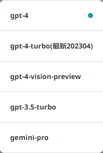

### 2. 支持插件功能
目前直接可用的包括：
- 搜索引擎：支持联网搜索
- 计算器：用于计算数学表达式
- 网页浏览器：从网页中提取信息或总结其内容
- 维基百科：从维基百科获取数据
- PDF浏览器：从pdf文件的url中提取文档信息或总结内容
- WolframAlpha：回答有关数学，科学，技术，文化，社会的问题

  后续在配套的中转服务也升级后，将支持的插件及模型：
    - 会读图的：gpt4-vision-preview
    - 文生图的：DALL.E3

    **意思是目前尊享版还不支持 画图 和 读图；**

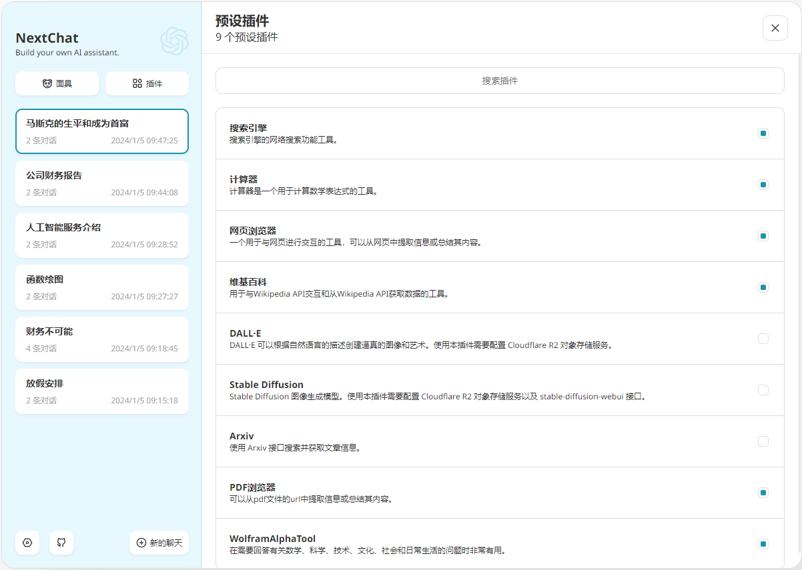

## 如何使用？

尊享版通过调用[国内OpenAI API 中转服务](/productivity/HaiAPI.md)的接口使用ChatGPT，接口调用需要用到密钥，也就是Key。

第一步：您需要先购买Key；

点击链接👉 [Ai自强少年的小店](https://shop.wehugai.com/) ，选择对应Token额度的Key购买即可：

点击链接👉 [Key查询及充值页](https://usage.hugai.top) ，将购买的Key填入，可以用量情况及响应速度：

买到的Key是以 **ak-开头的一长串英文**，区别于官方以sk-开头的Key;

第二步：将Key填入设置页面的**API KEY**, 点击重新检查，如果有余额显示，表示一切正常，可以开始聊天啦！

::: tip 小提示
如果key的额度用完了，您可以再购买一个新的，打开[充值页面](https://usage.hugai.top/), 将新Key的额度充值到之前的Key中，这样就不需要修改设置页面，比较方便。
:::

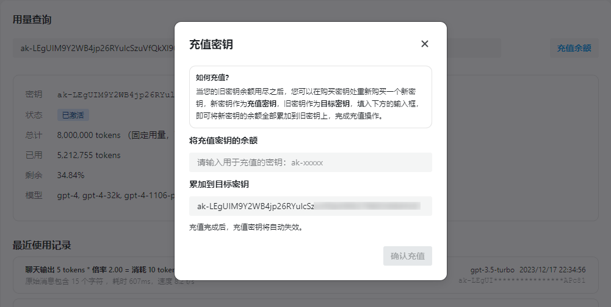

## 什么是插件？

"GPT" 是 "Generative Pre-trained Transformer" 的缩写，翻译成中文就是“生成式预训练变换器”，通过使用大量的文本数据进行预训练，学习了语言的结构和用法，使其能够生成、理解和回应人类语言。

**所以当前的GPT相当于一个静态的程序，并且只擅长处理文字。**

比如gpt-4-1106-preview 的训练数据截止到2023年4月；而gpt-3.5-turbo 知识截止2021年9月。

那我想跟大模型交流最近发生的事情怎么办？配套的插件便应运而生。

首当其冲的就是联网搜索的插件，GPT发现自己的知识库中不包含这类信息时，会主动去网上搜内容，然后再回答你的问题。

以此类推，大模型不擅长画图，所以就有了DALLE这种文生图的插件。当然DALLE本身是一个文生图的大模型，只是当它被ChatGPT调用时，你可以理解为一个外部插件。

**插件就是为了补充GPT不擅长的领域，我们提供了一堆工具给GPT使用，扩充它的能力范围，以更好地满足我们的需求。**

## 插件功能如何使用？

::: tip 建议
用插件的时候，模型选择最新的 gpt-4-1106-preview

**是否调用插件以及什么时候调用插件是由 GPT 自己决定的**，插件返回结果后再由 GPT 合并上下文信息，回答用户的问题，同样的工具给更聪明的模型用可以带来更好的效果。

而如果想触发一些插件可以在 prompt 中进行引导，比如：帮我在网上搜索xxx、使用wiki查找xxx、计算xxxxx等等，大家自行体验。
:::

### 1. 在插件列表页，将常用的勾选上

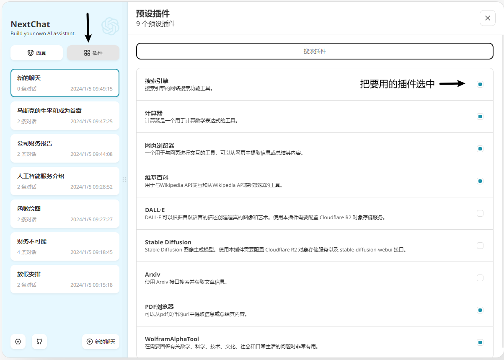

### 2. 在聊天窗口打开插件开关(默认是打开的)

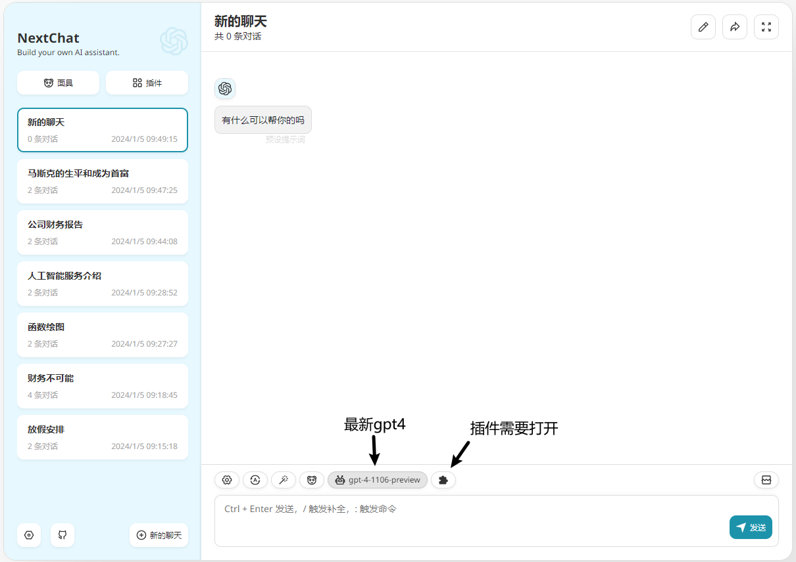

### 3. 插件功能使用示例

- 联网搜索，使用的搜索引擎是地表最强的那个：

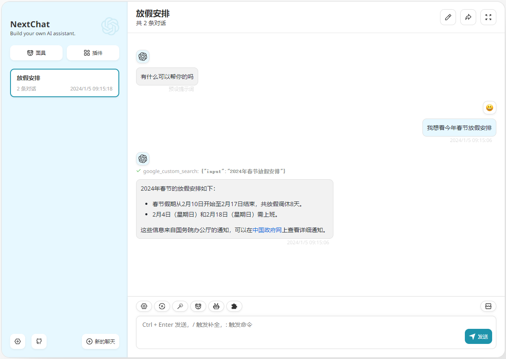

- PDF浏览器, 目前仅支持从pdf文件的url中提取文档信息或总结内容，不能直接上传pdf。

::: warning 提醒
pdf文档通常很大，解析pdf的内容需要不少时间，所以使用这个插件响应会慢，需要耐心。
:::

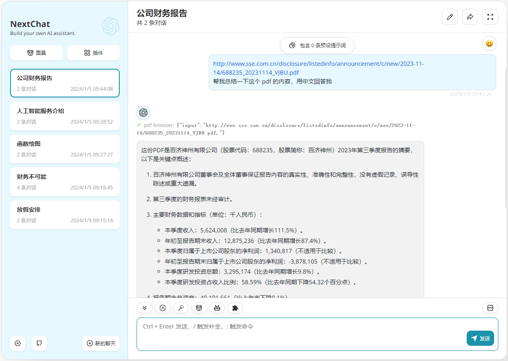

- 网页浏览器：从网页中提取信息或总结其内容

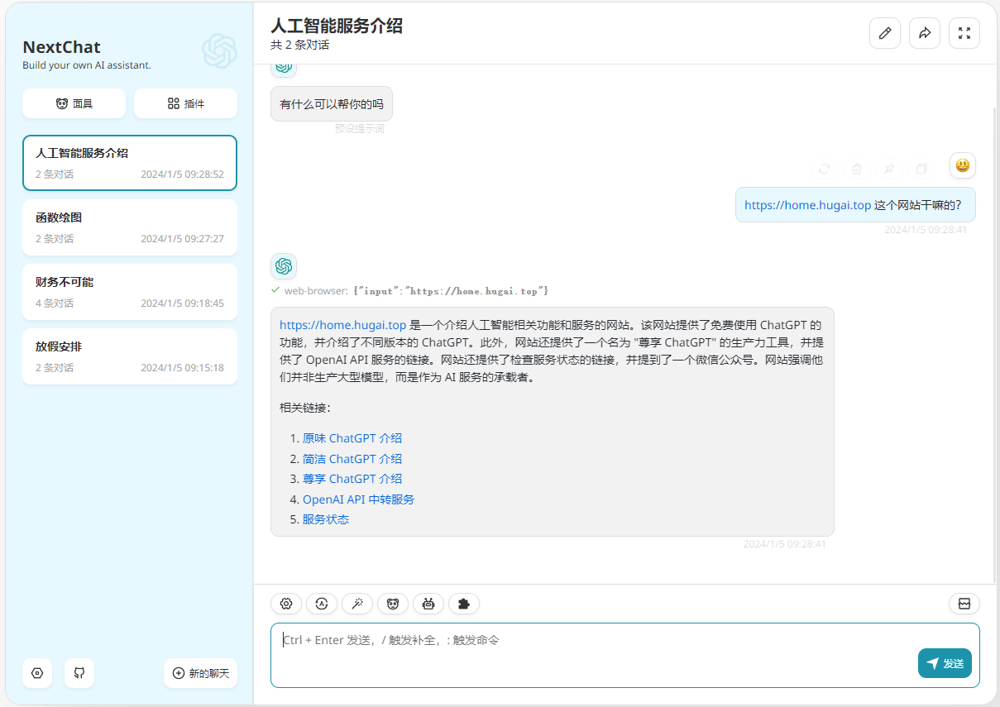

- 维基百科：有啥不懂的可以问问百科全书

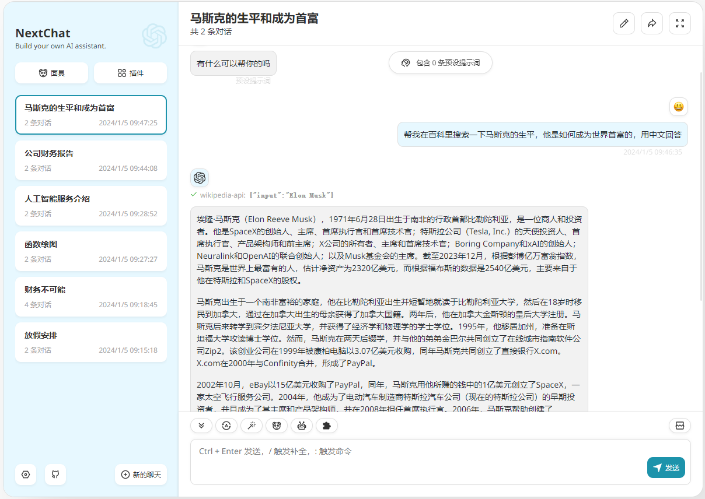

- WolframAlpha：回答有关数学，科学，技术，文化，社会的问题，功能强大，对搞学术的朋友比较有用

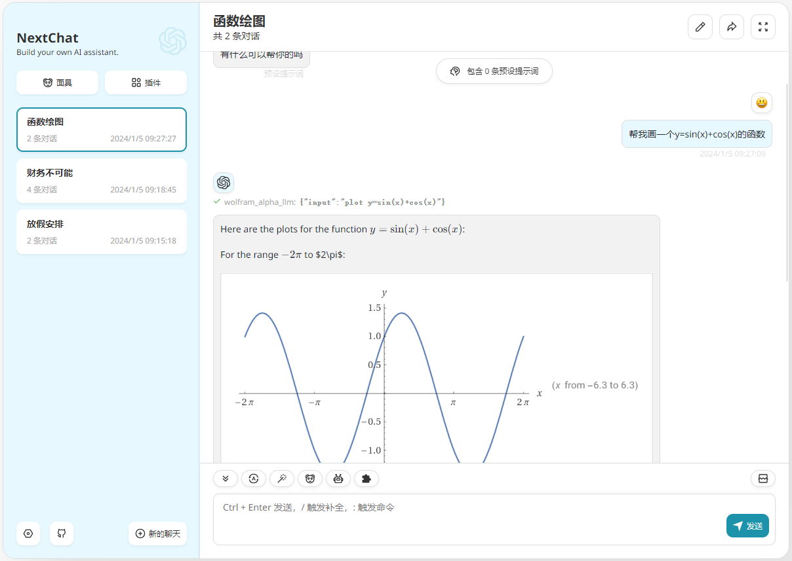

- 在同一个聊天窗口，插件可以组合使用，GPT 真的聪明

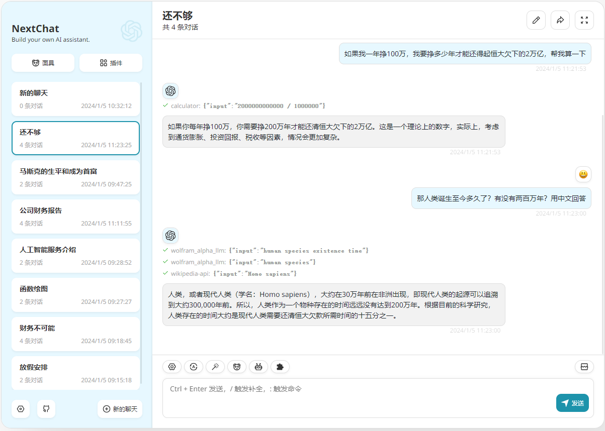

## 常见问题

### 为什么 gpt-4 额度消耗这么快？

- gpt-4 模型的消耗速度是 gpt-3.5-turbo 的 10 到 20 倍。
    
    假设购买了 5w token(1块钱)，我们用 15 倍作为平均倍率，也就是 50000 / 15 = 3000 字左右，加上每次要附带上历史消息，能发的消息数将会进一步减半，在最极限的情况下，一篇长文章就能把 5w token 消耗完，所以请谨慎使用。

### 有哪些节省 token 的小技巧？

- 点开对话框上方的设置按钮，找到里面的设置项：

    - **携带历史消息数**：数量越少，消耗 token 越少，但同时 gpt 会忘记之前的对话

    - **历史摘要**：用于记录长期话题，关闭后可以减少 token 消耗

    - **注入系统级提示词**：用于提升 ChatGPT 的回复质量，关闭后可减少 token 消耗

- 在对话时，点击对话框上方的机器人图标，可以快捷切换模型，可以优先使用 3.5 问答，如果回答不满意，再切换为 4.0 重新提问。

### 如何快速知道当前聊天的模型？

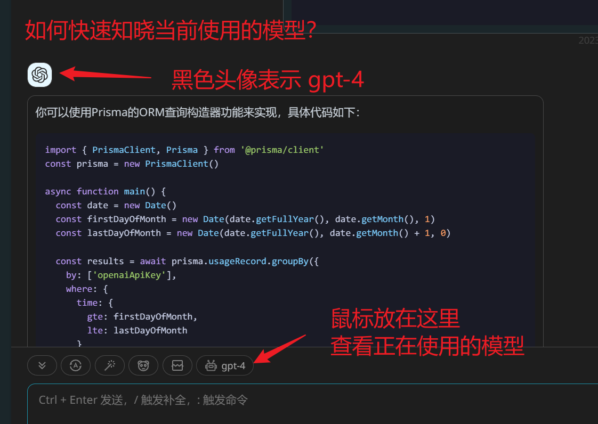

### 为什么使用插件时返回结果不固定，偶尔甚至无响应？

1. 是否调用插件，什么时候调用插件，传什么信息给插件都是由 GPT 自己决定的，插件返回结果之后也是GPT结合上下文再给回答的，因为GPT的回答本身就存在随机性，所以返回结果不固定。

2. 为了保证插件的效果，最好使用gpt-4 或 gpt-4 turbo模型 ，如gpt-4-1106-preview，更聪明，也更精确，gpt-3.5-turbo存在杜撰的可能性。

3. 不同的插件对应不同的三方服务接口，从插件调用到结果返回，服务器需要同时与插件接口和OpenAI交互，客观上就会慢，并且如果网络还出现波动，可能就会无响应了。

### 为什么吐字时快时慢，甚至偶尔无响应呢？

这个服务的可用，同时满足我提供的客户端服务，国内的OpenAI API中转服务，官方的OpenAI API 服务 都正常才行。

所以我贴心地在 导航栏 准备了一个[状态监控](https://status.hugai.top) 界面，如果出现持续性的网络波动，无响应，请先查看服务监控状态（不含插件服务）。

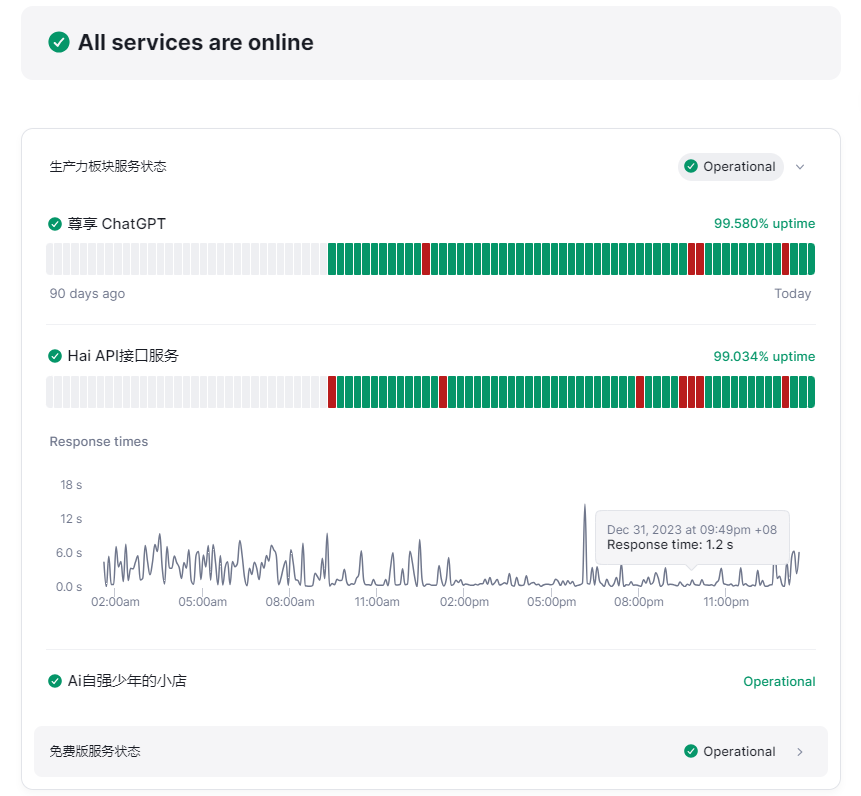