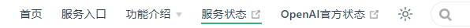

# 尊享 ChatGPT 介绍

::: tip 写在开始之前
您可以先查阅 [简洁 ChatGPT 介绍](/free/simple.md)，尊享版的界面与简洁版基本一致，如果您只需用到gpt-3.5-turbo(OpenAI) 或者 gemini-pro(Google),那可以直接用[简洁ChatGPT](https://simple.hugai.top)，而且是**免费**的，无需使用尊享版。
:::

🎉欢迎使用 Ai自强少年 提供的生产力 ChatGPT网页服务：尊享 ChatGPT, 本文仅介绍与[简洁 ChatGPT 介绍](/free/simple.md)有差异的部分。

::: tip 最新动态 2023-11-08
已支持 gpt-4-1106-preview，gpt-3.5-turbo-1106 。

gpt-4-vision-preview 仍在开发中，敬请期待。
:::

👉访问地址：[尊享ChatGPT](https://next.hugai.top) ([备用链接](https://nb.hugai.top)), 需要搭配Key使用。

👉购买Key：[Ai自强少年的小店](https://shop.zhongzhuanyong.fun)。

🚦网络环境：各地网络环境不同，如无法访问则说明缘分未到，不必勉强。若是钢铁般的需求，可以公众号私信联系，我帮你想想办法。

## 与简洁版相比强在哪？

1. 尊享版支持gpt4，目前已支持 gpt-4-1106-preview，知识库更新到2023年4月；而gpt-3.5-turbo 知识库截止2021年9月。

    

2. 后续会继续支持多模态输入输出模型：
    - 会读图的：gpt4-vision-preview
    - 文生图的：DALL.E3
    - 文本转语音的：tts
    - 语音转文字的：whisper

3. 后续会继续支持插件功能；

## 如何使用？

尊享版通过调用[国内OpenAI API 中转服务](/productivity/HaiAPI.md)的接口使用ChatGPT，接口调用需要用到密钥，也就是Key。

第一步：[您需要先购买Key](/productivity/HaiAPI.html#如何购买key); 买到的Key是以 **ak-开头的一长串英文**，区别于官方以sk-开头的Key;

第二步：[将Key填入设置页面的**API KEY**](/productivity/HaiAPI.html#在-尊享chatgpt-中使用), 点击重新检查，就可以查询当前Key的使用情况。

第三步：如果key的额度用完了，您可以再购买一个新的Key，打开[充值页面](https://usage.hugai.top/), 将新Key的额度充值到之前的Key中，这样就不需要在设置页面重新填Key，比较方便。

## 常见问题

### 为什么 gpt-4-turbo 额度消耗这么快？

- gpt-4-turbo 的消耗速度是 gpt-3.5-turbo 的 10 到 20 倍。
    
    假设购买了 5w token(1块钱)，我们用 15 倍作为平均倍率，也就是 50000 / 15 = 3000 字左右，加上每次要附带上历史消息，能发的消息数将会进一步减半，在最极限的情况下，一篇长文章就能把 5w token 消耗完，所以请谨慎使用。

### 有哪些节省 token 的小技巧？

- 点开对话框上方的设置按钮，找到里面的设置项：

    - **携带历史消息数**：数量越少，消耗 token 越少，但同时 gpt 会忘记之前的对话

    - **历史摘要**：用于记录长期话题，关闭后可以减少 token 消耗

    - **注入系统级提示词**：用于提升 ChatGPT 的回复质量，关闭后可减少 token 消耗

- 在对话时，点击对话框上方的机器人图标，可以快捷切换模型，可以优先使用 3.5 问答，如果回答不满意，再切换为 4.0 重新提问。

### 如何快速知道当前聊天的模型？

### 为什么吐字时快时慢，甚至偶尔无响应呢？

这个服务的可用，同时满足我提供的客户端服务，国内的OpenAI API中转服务，官方的OpenAI API 服务 都正常才行。

所以我贴心地在 [首页](https://home.hugai.top)导航栏 准备了一个[状态监控](https://status.hugai.top) 界面，如果出现持续性的网络波动，无响应，请先查看服务监控状态。

