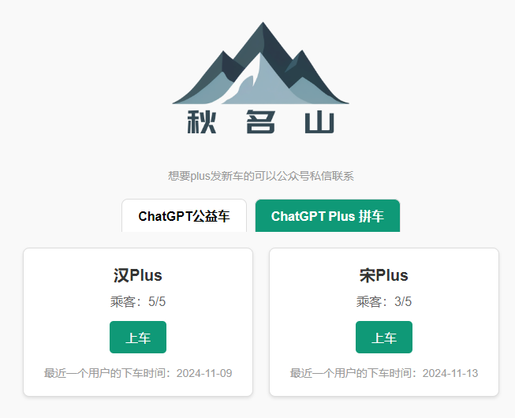
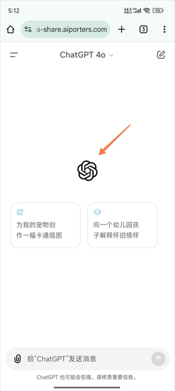
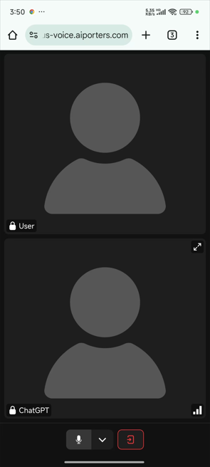
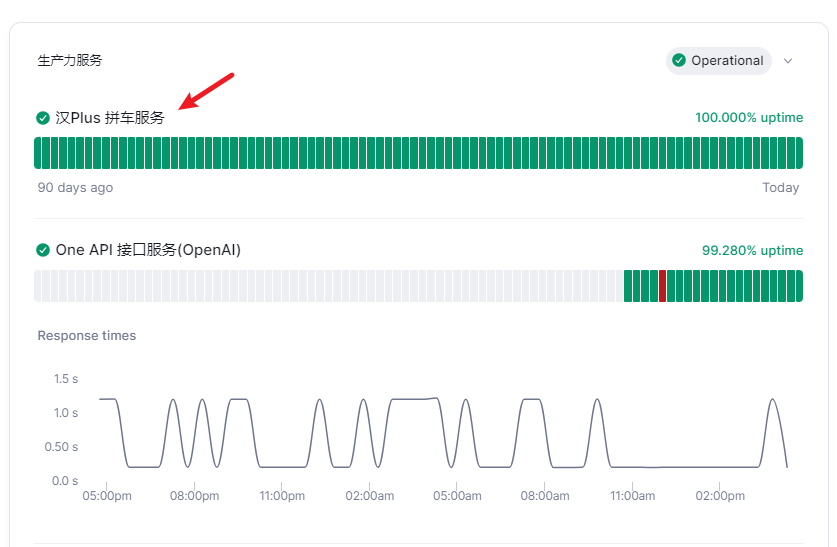

# Ai 拼车服务

::: tip 最新动态 2024-11-28

- Claude Pro 拼车服务 **海豹Pro，海马Pro，海鸥Pro，海狮Pro，海豚pro** 上线；
- ChatGPT Plus 拼车服务 **汉Plus，宋Plus，元Plus** 停服下线；

:::

🎉欢迎使用 Ai自强少年 提供的 ChatGPT Plus  & Claude Pro 拼车服务，国内直连，会话隔离，简单优雅。

👉拼车服务站点的访问地址 [Ai 拼车服务](https://station.aiporters.com/)。

👉~~ChatGPT Plus 在线车辆~~ ：[汉 Plus](https://hanplus.aiporters.com/) [宋 Plus](https://songplus.aiporters.com/) [元 Plus](https://yuanplus.aiporters.com/)

👉Claude Pro 在线车辆：[海豹 Pro](https://haibaopro.aiporters.com/) [海马 Pro](https://haimapro.aiporters.com/) [海鸥 Pro](https://haioupro.aiporters.com/) [海狮 Pro](https://haishipro.aiporters.com/) [海豚 Pro](https://haitunpro.aiporters.com/)

💡请在外部浏览器打开，微信可能屏蔽了本站域名。。。

🚦网络环境：各地网络环境不同，如无法访问则说明缘分未到，不必勉强。若是钢铁般的需求，可以公众号私信联系，我帮你想想办法。

## 这是什么？

简单说就是国内可以直接访问的 Chatgpt Plus & Claude Pro 官方镜像。

国内用户使用ChatGPT Plus & Claude Pro 需要面对两个难题：

  - 首先，订阅 Plus 是一门技术活，中国和香港地区发行的卡都不支持，OpenAI 和 Anthorpic 的风控也一直在升级，封卡封号的情况时有发生；

  - 其次，每个月支付 20 美元 对很多人来说还是有点压力的；

因此，这个服务方便没账号或者无法订阅Plus的朋友们，以相对低的价格在国内直接使用官方的Chatgpt Plus & Claude Pro 服务。

**无需VPN，无需注册，按月付费，会话隔离，简单优雅。**

## 如何使用？

::: tip 太长不看版

1. 打开[ChatGPT & Claude 拼车服务站点](https://station.aiporters.com/)，你将看到这样一个页面：

2. 找一辆还没满员的乘客，这里我们以汉 Plus举例说明：

打开[汉 Plus](https://hanplus.aiporters.com/)，你将看到这样一个页面：

3. 第一次用，你可以自定义一个用户名，然后买票填入上车即可；

4. 车票为一次性使用，每次上车时长为1个月，确保还有位置再上车；

5. 后续使用，直接凭用户名上车即可，无需填车票；

6. 页面上会根据用户名生成你的专属链接，可直接访问；

:::

### 1. 如果你是第一次上车

你需要同时填写 **用户名** 和 **车票**，然后点击**上车**按钮即可。

通过验证之后，你就会进入这个跟官方无限接近的页面，畅享官方服务：

**用户名：由你自定义，既是账号，也是密码。**

它的作用有二：

  - 用于会话隔离，每个用户只能看到自己的聊天记录，看不到其他用户的内容，保证隐私。
  - 生成你的专属链接，可以分享给你的亲朋好友直接使用。

:::tip 友情提示

用户名最好是：**你能轻易记住，又不容易被别人猜到，长度在6位以上**。

第一次登录后，车票就作废了，**后续直接输入用户名，点上车即可**；

车票是一次性的，不会过期，但用完作废。

:::

**车票**：就是你的一次性上车凭证，需要到[AI自强少年的小店](https://store.wehugai.com/buy/5) 进行购买。购买前先查看商品详情，对号入座，别买错了。

::: tip 注意

购买车票前，先看当前车上是否满员，假如已经有5个人了，先别买，买了也上不了车，这也是为了保证车上乘客的用户体验。

如果需求迫切，可以给我私信看最近是否有新车要开，或者就耐心等一等有乘客到期自动下车了，你再买票上车，已经买的车票不会过期，放心。

:::

### 2. 如果你已经上过车了

日常使用，有两种快速登录的方式。

#### 2.1 在拼车页面登录

此时，你只需要填写 **用户名** ，然后点击**上车**按钮即可。（**不必填车票**）

填写用户名1秒后就能看到你的账号到期日。

每天早上8点系统会查看是否有到期的乘客，到期了会自动请乘客下车。

#### 2.2 通过专属链接直接使用

举例说明，你的用户名是hello2024，那么就可以通过页面上生成的专属链接👇：

[https://hanplus.aiporters.com/?un=hello2024](https://hanplus.aiporters.com/?un=hello2024)

直接访问，你买票，为她(他)生成专属链接，请她(他)上车，泰裤啦！

### 3. 一个隐藏的小功能

除了图文交互之外，点击聊天窗口中OpenAI的logo，就能打开隐藏的最新的高级实时语音聊天功能：

但我不确定如果同时多人使用，我这个狭窄的带宽，是否能撑得住哈。。。

## 使用的注意事项

1. 拼车的优点就是大家可以均摊成本，但缺点就是大家都高频使用容易触发限制。目前官方的使用限制，我整理了一份表格：

2. 可用性：这个服务可用，需要同时满足我提供的域名服务，“始皇”的逆向服务，ChatGPT 或 Claude 的官方服务 三者都正常才行。

所以我贴心地在导航栏准备了一个[状态监控](https://status.hugai.top) 界面，如果出现持续性的报错，无响应，请先查看服务监控状态。

3. 在享受拼车服务的同时，请大家遵守OpenAI 及 Anthorpic 的内容政策，一旦收到OpenAI的警告邮件，对不爱惜车辆的乘客我将直接踢下车。所以，请不要做出会导致封号，影响到车辆正常运营，损害大家利益的事情，高抬贵手朋友们🤷。

4. 建议接触并尝试使用 ChatGPT Plus，它是所有人的外挂。比如这个拼车服务的代码，我就是参考论坛各位大佬提供的代码后，用GPT4完成的。。。**毕竟没有人比我更懂如何抄代码**。

## 关于车票的定价

一辆车的成本由以下几部分组成：

#### 1. ChatGPT Plus 和 Claude Pro 的订阅费用：20美元/月

目前1美元在7.2人民币左右波动。

但因为我没有国外发行的信用卡，只能通过虚拟卡来绑定支付。

目前我在用的虚拟卡充值汇率约为7.56，每笔消费还需要支付5%的手续费。这部分在[One API中转服务](/productivity/one-api.md)的介绍中也提到过了。

所以折算下来，我的实际汇率是 **1美元 ≈ 8人民币**😂。

因此，**ChatGPT Plus的订阅费用约为：160元/月**。

#### 2. 订阅一个新的Plus号，需要额外花5美元开一张新的虚拟卡

保险起见，通常一张虚拟卡只能绑定一个Plus号，否则容易出现封号封卡的情况，得不偿失。

当然很多时候碰到这种无法支付的情况，这个卡就废了：

所以，能稳定支付成功，我就已经知足了。

因此，如果**新开一辆车**，我至少**还需要支付40元**来开通新的虚拟卡。

#### 3. 封号封卡成本

这部分属于潜在的损失，但目前我订阅Plus也有一年了，没有翻车。我向来求稳不求便宜，可以暂不考虑这部分损失。

综上，新开一辆车的固定支出：

  - **第一个月的成本为200元，后续每个月为160元**

而我们的车票基本上就是基于成本定价，以我不贴钱为基准，尽量让大家从容优雅上车。😄

## 退款情况说明

拼车依赖的服务还是蛮多的，有这么几种情况会翻车，比如：

- 被OpenAI 或者 Anthorpic 封号了；
- 始皇的逆向服务挂了；
- 我的代理服务挂了；

如果能及时救回来的，请大家耐心等待；
如果救不回来了，**我会按照大家的上车时长来退款，比如上车不超过7天的我就全额退了，请各位放心。**