# ChatGPT Plus 拼车服务

🎉欢迎使用 Ai自强少年 提供的 ChatGPT Plus 拼车服务，国内直连，会话隔离，简单优雅。

👉第一辆10人拼车的访问地址 [秦 Plus](https://qinplus.hugai.top)。

👉第二辆 6人拼车的访问地址 [汉 Plus](https://hanplus.hugai.top)。

💡请在外部浏览器打开，微信屏蔽了本站域名。。。

🚦网络环境：各地网络环境不同，如无法访问则说明缘分未到，不必勉强。若是钢铁般的需求，可以公众号私信联系，我帮你想想办法。

## 这是什么？

简单说就是国内可以直接访问的 Chatgpt Plus官方镜像。

国内用户使用ChatGPT Plus 需要面对两个难题：

  - 首先，订阅 Plus 是一门技术活，中国和香港地区发行的卡都不支持，OpenAI的风控也一直在升级，封卡封号的情况时有发生；

  - 其次，每个月支付 20 美元 对很多人来说还是有点压力的；

因此，这个服务方便没账号或者无法订阅Plus的朋友们，以相对低的价格在国内直接使用官方的Chatgpt Plus服务。

**无需VPN，无需注册，按月付费，会话隔离，简单优雅。**

第一辆车为了保证价格亲民，我决定先开个 10 人拼车试试水。

那既然是 plus，又是第一辆车，我决定就叫它 **秦 plus** 吧😄。

## 如何使用？

::: tip 太长不看版

1. 打开[秦 Plus](https://qinplus.hugai.top)，你将看到这样一个页面：

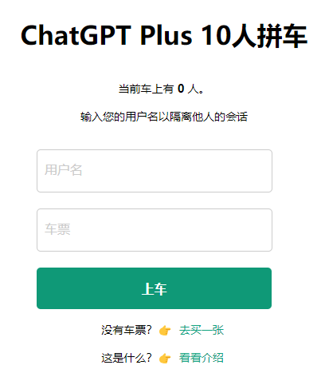

2. 第一次用，你可以自定义一个用户名，然后买票填入上车即可；

3. 车票为一次性使用，每次上车时长为1个月，确保还有位置再上车；

4. 后续使用，直接凭用户名上车即可，无需填车票；

5. 页面上会根据用户名生成你的专属链接，可直接访问。

:::

### 1. 如果你是第一次上车

你需要同时填写 **用户名** 和 **车票**，然后点击**上车**按钮即可。

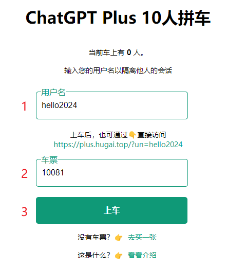

通过验证之后，你就会进入这个跟官方无限接近的页面，畅享官方服务：

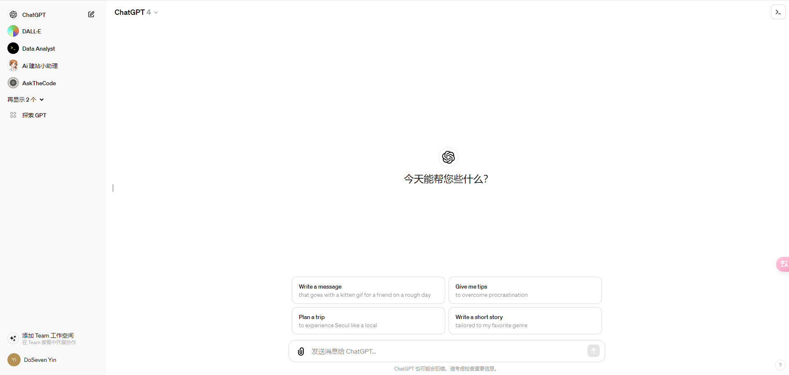

**用户名：由你自定义，既是账号，也是密码。**

它的作用有二：

  - 用于会话隔离，每个用户只能看到自己的聊天记录，看不到其他用户的内容，保证隐私。
  - 生成你的专属链接，可以分享给你的亲朋好友直接使用。

:::tip 友情提示

用户名最好是：**你能轻易记住，又不容易被别人猜到，长度在6位以上**。

第一次登录后，车票就作废了，**后续直接输入用户名，点上车即可**；

车票是一次性的，不会过期，但用完作废。

:::

**车票**：就是你的一次性上车凭证，需要到[AI自强少年的小店](https://shop.wehugai.com/buy/11) 进行购买。购买前先查看商品详情，对号入座，别买错了。

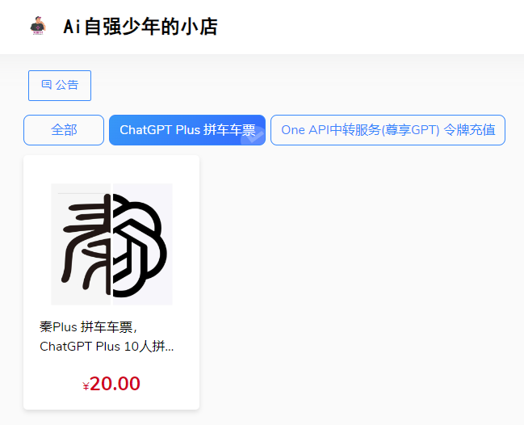

::: tip 注意

购买车票前，先看当前车上是否满员，假如已经有10个人了，先别买，买了也上不了车，这也是为了保证车上乘客的用户体验。

如果需求迫切，可以给我私信看最近是否有新车要开，或者就耐心等一等有乘客到期自动下车了，你再买票上车，已经买的车票不会过期，放心。

:::

### 2. 如果你已经上过车了

日常使用，有两种快速登录的方式。

#### 2.1 在拼车页面登录

此时，你只需要填写 **用户名** ，然后点击**上车**按钮即可。（**不必填车票**）

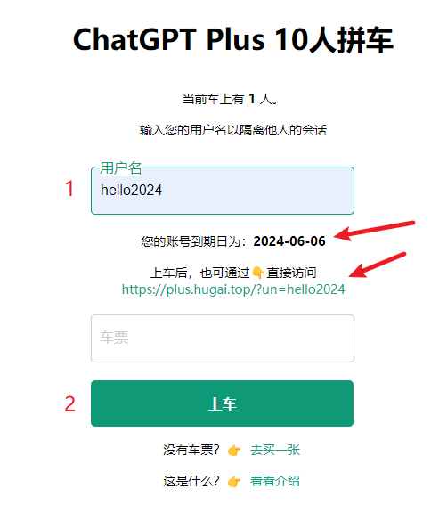

填写用户名1秒后就能看到你的账号到期日。

每天早上8点系统会查看是否有到期的乘客，到期了会自动请乘客下车。

#### 2.2 通过专属链接直接使用

举例说明，你的用户名是hello2024，那么就可以通过页面上生成的专属链接👇：

[https://qinplus.hugai.top/?un=hello2024](https://qinplus.hugai.top/?un=hello2024)

直接访问，你买票，为她(他)生成专属链接，请她(他)上车，泰裤啦！

## 使用的注意事项

1. 拼车的优点就是大家可以均摊成本，但缺点就是大家都高频使用容易触发限制。目前官方的使用上限规则：**每 3 小时 40 条消息，官方会动态调整；**

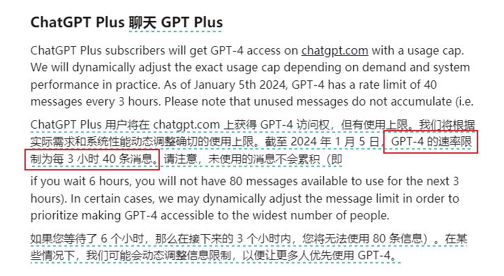

2. 可用性：这个服务可用，需要同时满足我提供的域名服务，“始皇”的逆向服务，OpenAI的官方服务 三者都正常才行。

所以我贴心地在导航栏准备了一个[状态监控](https://status.hugai.top) 界面，如果出现持续性的报错，无响应，请先查看服务监控状态。

3. 在享受拼车服务的同时，请大家遵守OpenAI的内容政策，一旦收到OpenAI的警告邮件，对不爱惜车辆的乘客我将直接踢下车。所以，请不要做出会导致封号，影响到车辆正常运营，损害大家利益的事情，高抬贵手朋友们🤷。

4. 建议接触并尝试使用 ChatGPT Plus，它是所有人的外挂。比如这个拼车服务的代码，我就是参考论坛各位大佬提供的代码后，用GPT4完成的。。。**毕竟没有人比我更懂如何抄代码**。

## 关于车票的定价

一辆车的成本由以下几部分组成：

#### 1. ChatGPT Plus的订阅费用：20美元/月

目前1美元在7.2人民币左右波动。

但因为我没有国外发行的信用卡，只能通过虚拟卡来绑定支付。

目前我在用的虚拟卡充值汇率约为7.56，每笔消费还需要支付5%的手续费。这部分在[One API中转服务](/productivity/one-api.md)的介绍中也提到过了。

所以折算下来，我的实际汇率是 **1美元 ≈ 8人民币**😂。

因此，**ChatGPT Plus的订阅费用约为：160元/月**。

#### 2. 订阅一个新的Plus号，需要额外花5美元开一张新的虚拟卡

保险起见，通常一张虚拟卡只能绑定一个Plus号，否则容易出现封号封卡的情况，得不偿失。

当然很多时候碰到这种无法支付的情况，这个卡就废了：

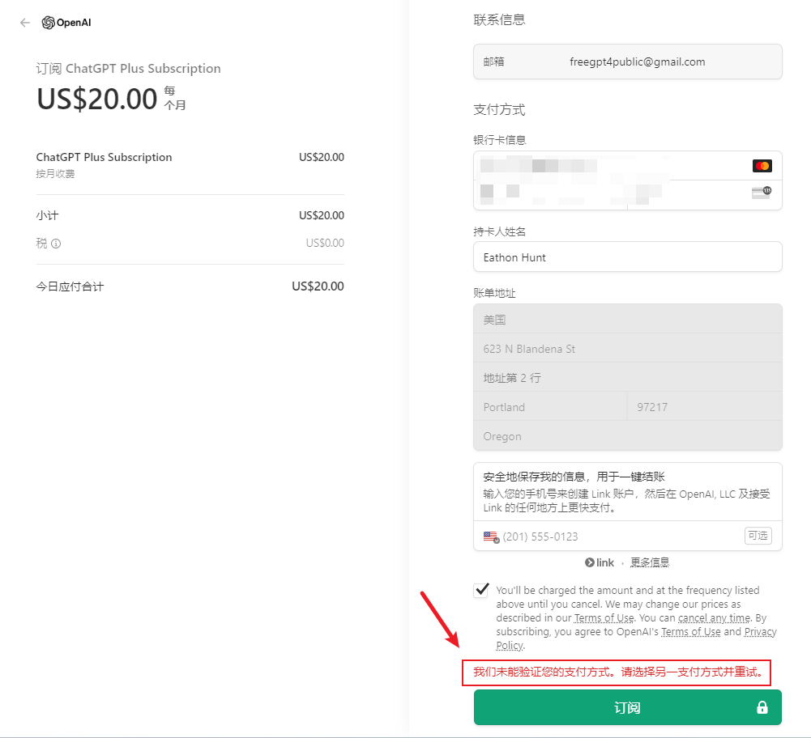

所以，能稳定支付成功，我就已经知足了。

因此，如果**新开一辆车**，我至少**还需要支付40元**来开通新的虚拟卡。

#### 3. 封号封卡成本

这部分属于潜在的损失，但目前我订阅Plus也有一年了，没有翻车。我向来求稳不求便宜，可以暂不考虑这部分损失。

综上，新开一辆车的固定支出：

  - **第一个月的成本为200元，后续每个月为160元**

而我们的车票基本上就是基于成本定价，以我不贴钱为基准，尽量让大家从容优雅上车。😄

当然如果需求量大，**后续就可以考虑组个王朝车队了**。汉plus，唐plus，宋plus就能接踵而至。

根据不同的用户需求提供不同的拼车人数。

而如果响应平平，连第一辆秦Plus都开不起来，那**秦也只能二世而亡**了，😂。

## 如何实现的？

最后聊聊这个拼车服务是如何实现的。

**这部分偏技术向，还有回忆杀，非IT人士可以忽略。**

半年前，我发布了供大家免费使用的[原味 GPT](/free/pandora.md)。

也是国内可以直接使用的 ChatGPT 官方镜像。没有账号的可以用我提供了免费的账号，或者直接在原味GPT上注册，再登录使用，而且也支持会话隔离，因此很受欢迎。

我特意记录了一下，巅峰的时候一天有过万的会话记录，也算造福了关注公号的朋友啦。

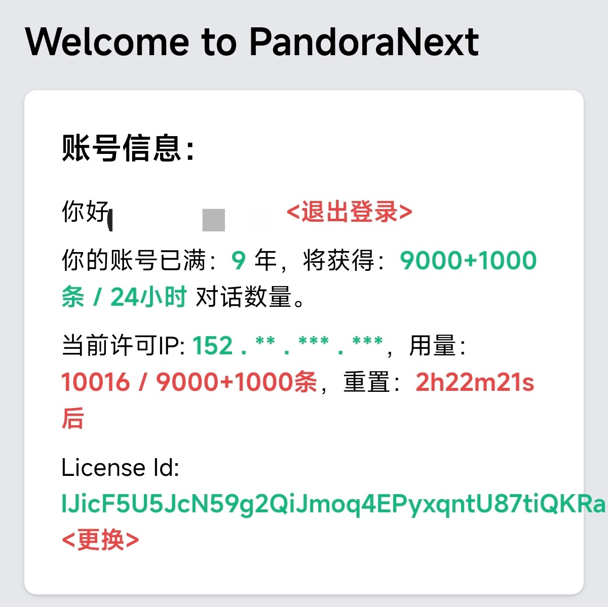

当然这个服务是逆向大佬 **我是秦始皇** 提供的，我只是接力一下。

后来始皇放弃维护了，我也只能停服,👉[Pandora大佬退出，免费时代落幕](https://mp.weixin.qq.com/s/0DFNsemz5JnTHs6LCYo-3A)。

最近，始皇复出了，值得举杯同庆！

不过因为 OpenAI 的防黑能力也升级了，提供逆向服务的成本也变高了，始皇选择只提供 Plus 账号的直连服务。

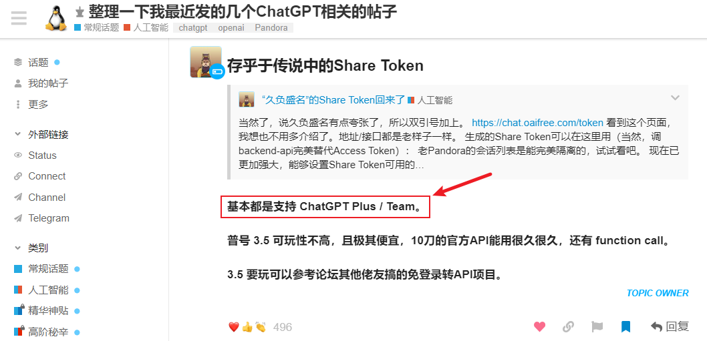

也就是说，**只有开通了 Plus 的账号才能使用始皇提供的服务**，这样人数没那么多，也不容易被 OpenAI 针对，细水长流，行稳致远。

不仅如此，始皇还写了[一系列的帖子](https://linux.do/t/topic/47799)教大家如何使用。

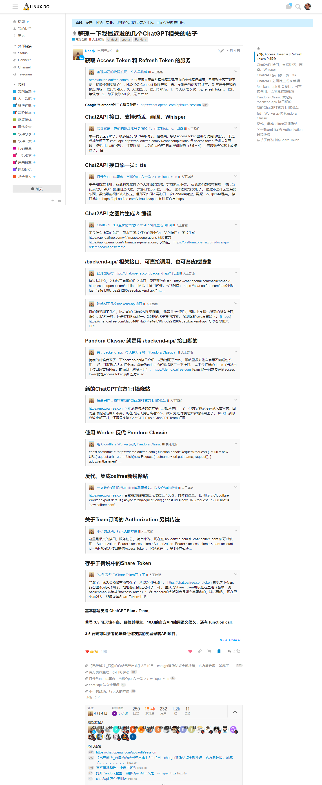

所以，**本服务首先基于始皇的逆向服务和这一系列喂饭级别的帖子**，感谢。

其次，**要感谢linux.do论坛所有接力的坛友们。**

我主要参考了这两个帖子的内容：

[【优雅+安全】GPT4私人拼车神器——轻松实现聊天隔离+链接直达+全自动刷新token](https://linux.do/t/topic/59043)

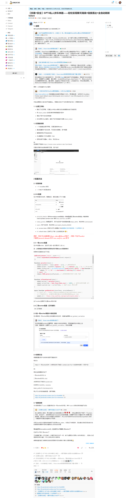

[【优雅再+】GPT4私人拼车神器【UI版】——聊天隔离+站密码+自动刷新token](https://linux.do/t/topic/60166)

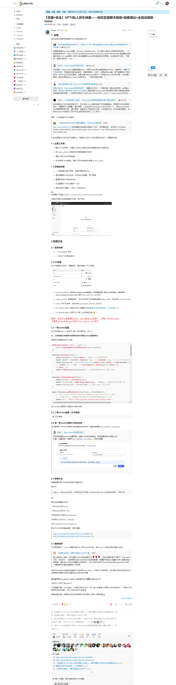

第三个：**当然要感谢全能的GPT-4**，让只会抄代码的我能够接力为公号的朋友提供这个Plus拼车服务。

最后，附上我迭代了5个版本的需求记录，让大家看看我是如何用GPT4完成这个拼车服务的👇。

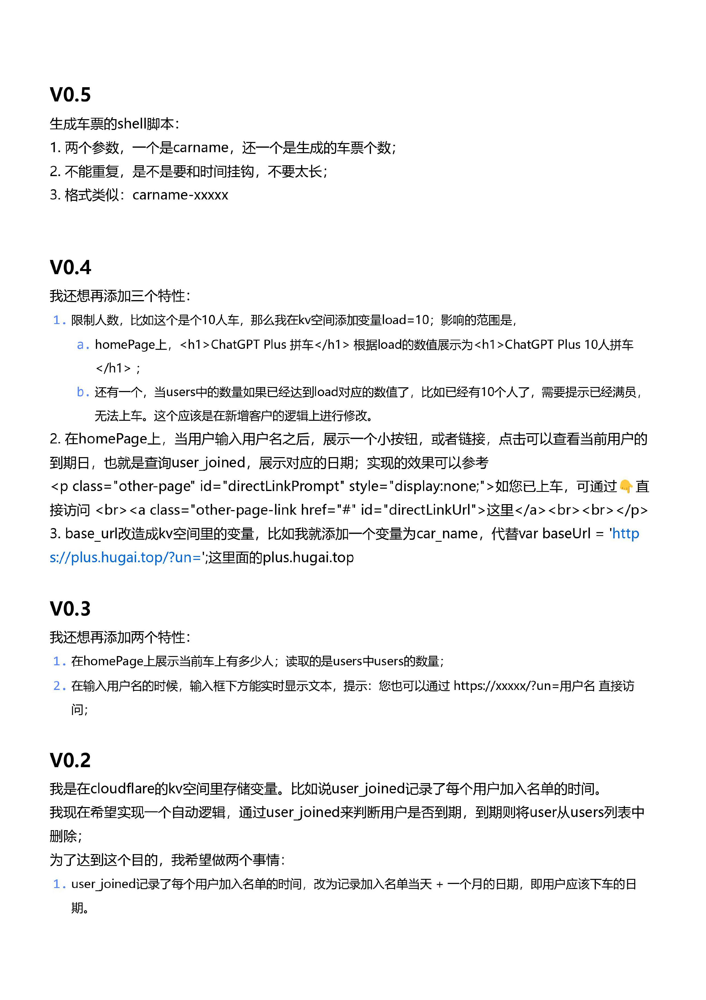
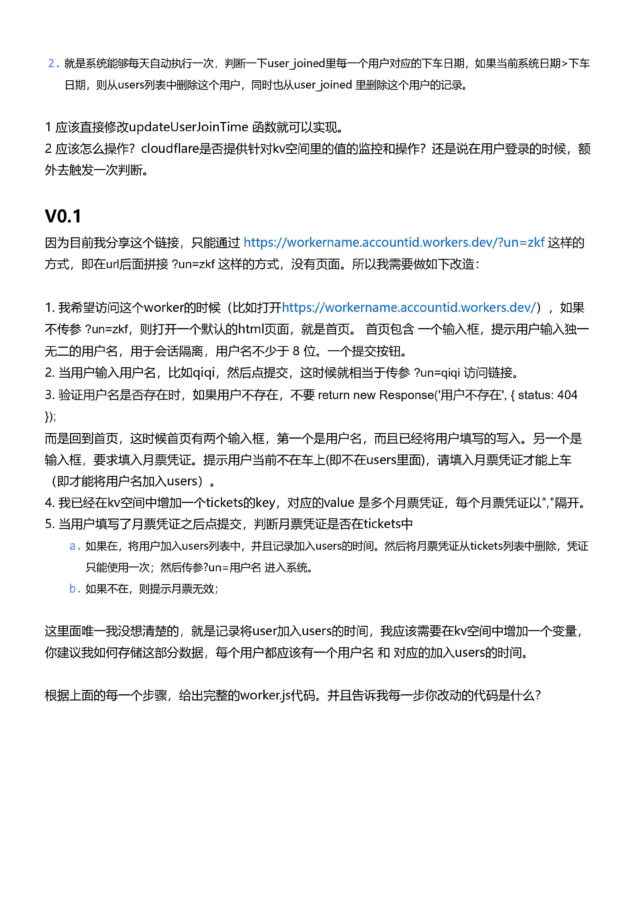

GPT-4很强，但并非万能，你需要给它足够的上下文来实现你的目标。

期待GPT-5能够早日到来，让使用门槛进一步降低，成为更多人的得力助手🙏。

