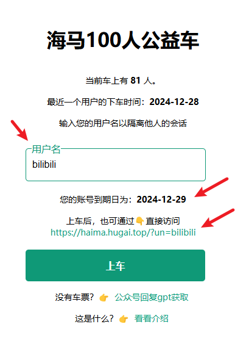

# Claude Pro 拼车

::: tip 最新动态 2024-11-28

- Claude Pro 海洋车队上线；

:::

🎉欢迎使用 AI自强少年 提供的 Claude Pro 拼车服务，国内直连，会话隔离，简单优雅。

👉拼车服务的访问地址: [https://station.aiporters.com](https://station.aiporters.com/)。

👉Claude Pro 海洋车队：[海王 Pro](https://haiwangpro.aiporters.com/) [海豹 Pro](https://haibaopro.aiporters.com/) [海马 Pro](https://haimapro.aiporters.com/) 等等。。。

🔔车站不定期发新车，保持关注即可，或者后台私信联系。

🚦网络环境：请在外部浏览器打开链接，微信可能屏蔽了本站域名。如果响应速度慢或者打不开，请参考 [当你无法访问本站服务](/tips/cloudflare-speed.md);

## 这是什么？

简单说就是国内可以直接访问的 Claude Pro 官方镜像。

国内用户使用 Claude Pro 需要面对两个难题：

  - 首先，订阅 Pro 是一门技术活，中国和香港地区发行的卡都不支持，Anthorpic 的风控也一直在升级，封卡封号的情况时有发生；

  - 其次，每个月支付 20 美元 对很多人来说还是有点压力的；

因此，这个服务方便没账号或者无法订阅Claude Pro的朋友们，以相对低的价格在国内直接使用官方的 Claude Pro 服务。

**无需魔法，无需注册，按月付费，会话隔离，简单优雅。**

## 如何使用？

::: tip 太长不看版

1. 打开[Claude Pro 拼车服务](https://station.aiporters.com/)，你将看到这样一个页面：

2. 找一辆还没满员的乘客，这里我们以 海豹Pro 举例说明：

打开[海豹 Pro](https://haibaopro.aiporters.com/)，你将看到这样一个页面：

3. 第一次用，你可以自定义一个用户名，然后买票填入上车即可；

4. 车票为一次性使用，每次上车时长为1个月，确保还有位置再上车；

5. 后续使用，直接凭用户名上车即可，无需填车票；

6. 页面上会根据用户名生成你的专属链接，可直接访问；

:::

### 1. 如果你是第一次上车

你需要同时填写 **用户名** 和 **车票**，然后点击**上车**按钮即可。

通过验证之后，你就会进入这个跟官方无限接近的页面，畅享官方服务：

**用户名：由你自定义，既是账号，也是密码。**

它的作用有二：

  - 用于会话隔离，每个用户只能看到自己的聊天记录，看不到其他用户的内容，保证隐私。
  - 生成你的专属链接，可以分享给你的亲朋好友直接使用。

:::tip 友情提示

用户名最好是：**你能轻易记住，又不容易被别人猜到，长度在6位以上**。

第一次登录后，车票就作废了，**后续直接输入用户名，点上车即可**；

:::

**车票**：就是你的一次性上车凭证，需要到[AI自强少年的小店](https://smallshop.wehugai.com/buy/5) 进行购买。购买前先查看商品详情，对号入座，别买错了。车票是一次性的，不会过期，但用完作废。

::: tip 注意

购买车票前，先看当前车上是否满员，假如已经有5个人了，先别买，买了也上不了车，这也是为了保证车上乘客的用户体验。

:::

### 2. 如果你已经上过车了

日常使用，有两种快速登录的方式。

#### 2.1 在拼车页面登录

此时，你只需要填写 **用户名** ，然后点击**上车**按钮即可。（**不必填车票**）

填写用户名1秒后就能看到你的账号到期日。

每天早上8点系统会查看是否有到期的乘客，到期了会自动请乘客下车。

#### 2.2 通过专属链接直接使用

举例说明，你的用户名是hello2024，那么就可以通过页面上生成的专属链接👇：

`https://haibaopro.aiporters.com/?un=hello2024`

直接访问，你买票，为她(他)生成专属链接，请她(他)上车，泰裤啦！

## 使用的注意事项

1. Claude Pro是否有任何使用限制？

  是的。Claude Pro 提供的使用量至少是我们免费服务的5倍。
  
  您可以发送的消息数量会根据消息长度、附加文件的长度以及当前对话的长度而有所不同。如果您的对话相对较短，您**每5小时可以预期发送至少45条消息**，实际数量通常会更多，这取决于消息长度、对话长度和Claude当前的处理能力。当您只剩下1条消息时，我们会提供警告。
  
  **您的消息限制将每5小时重置一次。**

  所以，拼车的优点就是大家可以均摊成本，但缺点就是有时候登录上来会发现额度已经被其他乘客用光了。

2. 可用性：这个服务可用，需要同时满足我提供的域名服务，“始皇”的逆向服务，Claude 的官方服务 三者都正常才行。

3. 在享受拼车服务的同时，请大家遵守 Anthorpic 的内容政策，一旦收到Anthorpic的警告邮件，对不爱惜车辆的乘客我将直接踢下车。所以，请不要做出会导致封号，影响到车辆正常运营，损害大家利益的事情，高抬贵手朋友们🤷。

## 关于车票的定价

一辆车的成本由以下几部分组成：

#### 1. Claude Pro 的订阅费用：20美元/月

目前1美元在7.3人民币左右波动。

但因为我没有国外发行的卡，只能通过虚拟卡来绑定支付。

虚拟卡充值汇率会比实际汇率高，每笔消费还需要支付3%-5%的手续费。这部分在[One API中转服务](/productivity/one-api.md)的介绍中也提到过了。

所以折算下来，我的实际汇率 **1美元 ≈ 8人民币** 😂。

因此，**Claude Pro 的订阅费用约为：160元/月**。

#### 2. 开虚拟卡的成本

保险起见，通常1张虚拟卡尽量只绑1个Pro号，否则容易出现封号封卡的情况，得不偿失。

当然很多时候碰到这种无法支付的情况，这个卡就废了：

所以，能稳定支付成功，我就已经知足了。

因此，如果**新开一辆车**，我**还需要支付5美元**来开通新的虚拟卡。

#### 3. 封号封卡成本

这部分属于潜在的损失，而且通常封号我会给大家退钱，保证大家不亏，算我倒霉。

综上，新开一辆车的固定支出：

  - **第一个月的成本约为200元，后续每个月为160元**

而我们的车票基本上就是基于成本定价，以我不贴钱为基准，尽量让大家从容优雅上车。😄

## 退款情况说明

拼车服务依赖的条件还是蛮多的，有这么几种情况会翻车，比如：

- 被 Anthorpic 封号了；
- 始皇的逆向服务挂了；
- 我的服务器被端了；

如果能及时救回来的，我会及时通知大家，请大家耐心等待；

如果救不回来了，**我会按照大家的上车时长来退款，比如上车不超过7天的我就全额退了，请各位放心。**

除了以上翻车的情况，仅因为拼车人多导致额度不够用的情况，就别找我退款了。。。**上面已经把拼车的优缺点说清楚了，看明白了再买票**，高频用户建议选人少的车，或者独占一个号。