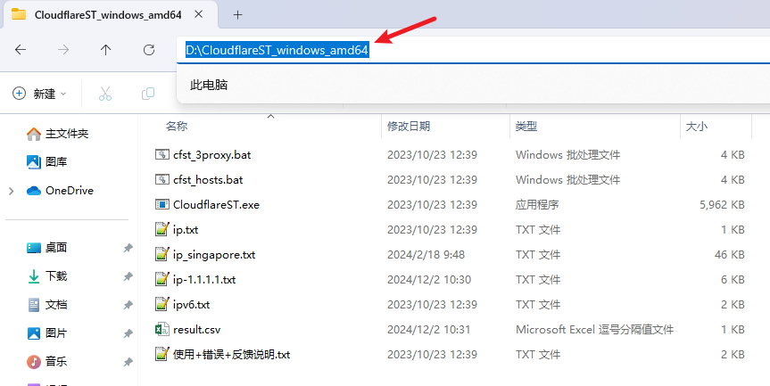
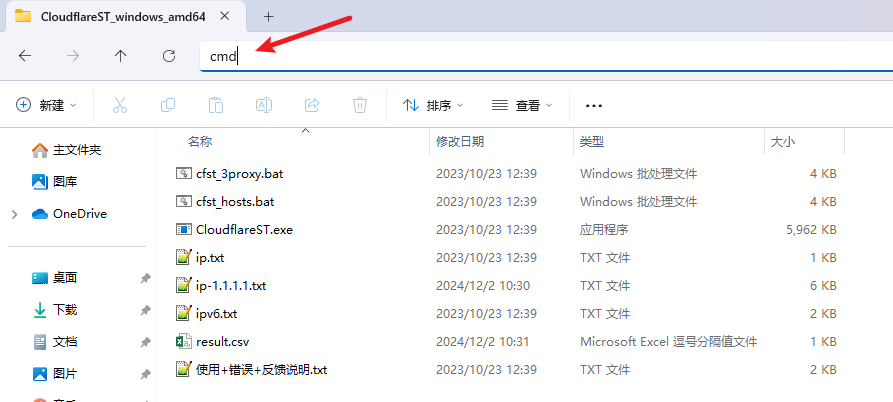
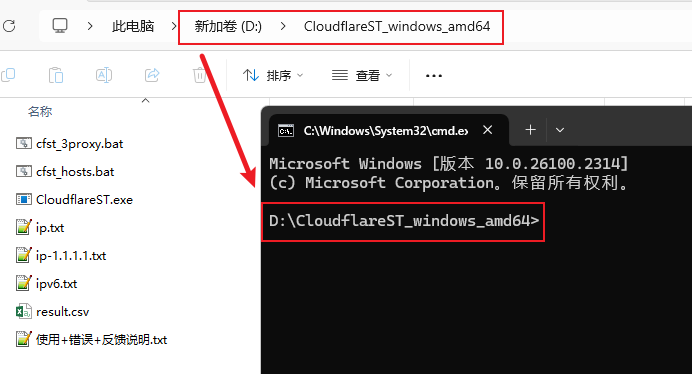
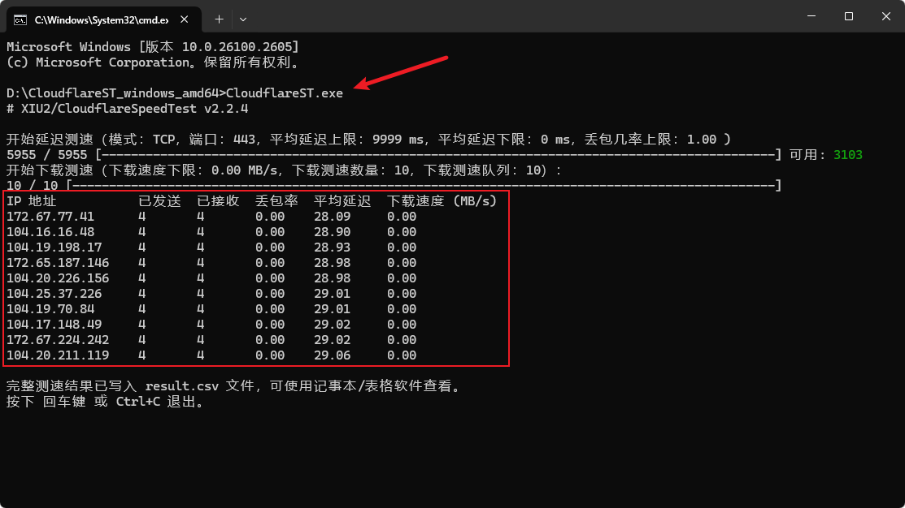
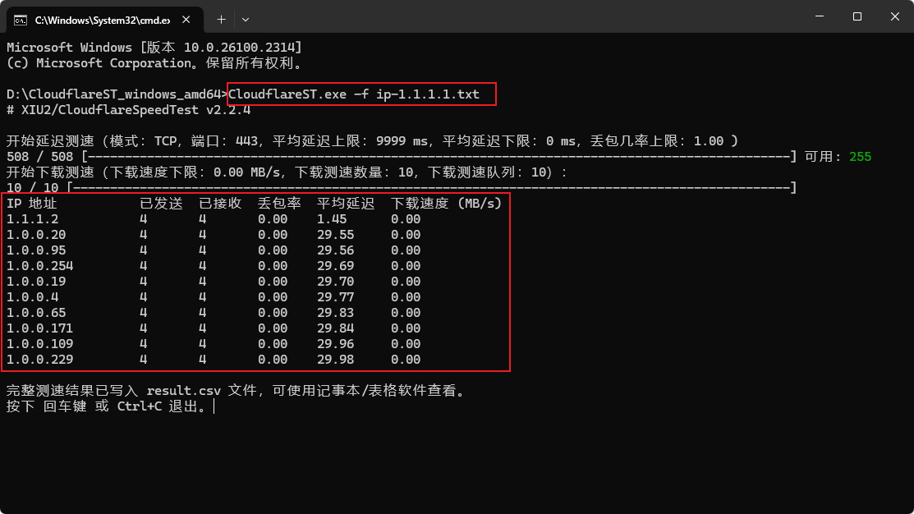
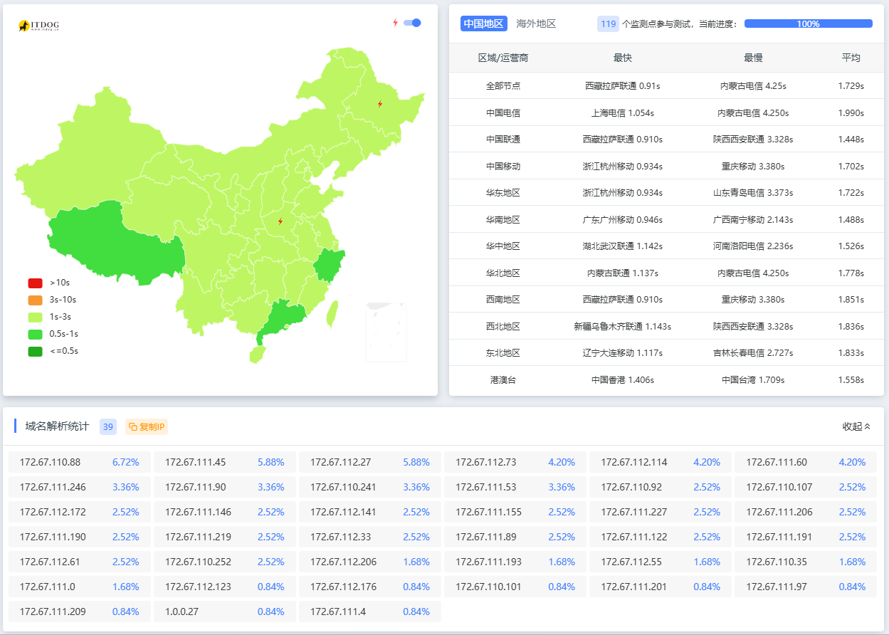
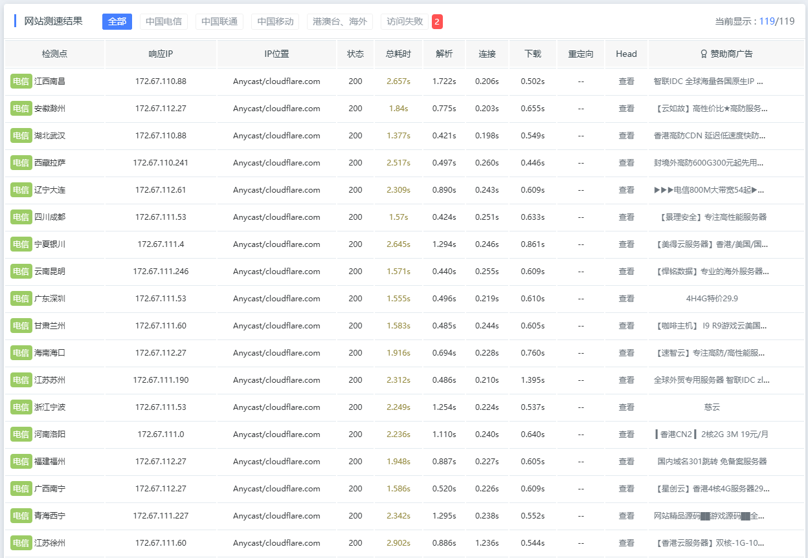

# 如果你想提升本站的访问速度

## 写本文的目的

建站以来，提供了不少服务，不管是公益车站，还是拼车，以及one-api等等，也吸引来了不少用户，非常荣幸。

而因为一些限制，我的服务器并不在国内，所以总是会有一些朋友无法打开网站，或者说访问的时候特别慢，很影响体验。

以前我在每个服务的介绍都配了一条说明：

🚦网络环境：各地网络环境不同，如无法访问则说明缘分未到，不必勉强。若是钢铁般的需求，可以公众号私信联系，我帮你想想办法。

办法是有的，只不过我一个人无法及时响应所有需求，所以今天干脆抽点时间出来写一篇小技巧，**大家只要按步骤操作，大概率能解决无法访问本站服务的问题。**

我们先讲具体操作，后面再说明原理；

## 操作部分

1. 下载这个开源软件 [XIU2/CloudflareSpeedTest](https://github.com/XIU2/CloudflareSpeedTest/releases)，无法打开就用我提供的百度网盘链接：[CloudflareST_windows_amd64.zip](https://pan.baidu.com/s/1aDPJm2YVoHlpJVwdmmtK9A?pwd=8888')，解压到D盘，然后你应该看到这样的页面：



::: warning
注意目录层级，解压后是 D:\CloudflareST_windows_amd64
:::

2. 在文件路径导航栏直接输入 **cmd** ，敲回车，你就应该进入命令行界面，并且是在 D:\CloudflareST_windows_amd64 这个目录下；





3. 在命令行里敲入命令：```CloudflareST.exe```，敲回车，你将得到一些IP地址，这些都是Cloudflare对外公布的CDN节点IP：



::: warning
执行之前，记得关掉VPN
:::

然后，我们可以再执行一次命令：```CloudflareST.exe -f ip-1.1.1.1.txt ```，这次带上我们给定的ip地址列表，在这里面挑优质IP：




4. **把这些ip地址都复制出来，或者截图私信发给我就行。**

5. 对了，还要告知你目前所在的省份，以及使用的网络运营商是电信，联通还是移动。如果不清楚的，打开[百度](https://www.baidu.com)，搜索框输入ip，百度一下就能看到了：


比如我目前在用的网络属于：上海，中国电信。

6. 我就可以在域名解析上进行调整，以实现：上海地区，中国电信的网友们就走 上面那个1.1.1.2 这个地址来访问我的网站，这样速度最快，就这么简单。

## 原理部分

这里涉及到一部分网络的知识，我尽量通俗地把原理说清楚。

1. 我的服务器在国外，大家通过域名访问，最简单的方式就是域名直接指向我的服务器地址。但这样要么服务器被攻击，要么IP被和谐。我第一次搭网站的时候就这样，撑不过两周。

2. 所以，我们必须用CDN代理，让所有用户请求先过CDN，然后再到我的服务器，这样一来我可以不暴露我的服务器IP，二来可以防止DDoS攻击；

3. 于是，我选择了大名鼎鼎的 Cloudflare 提供的CDN服务。因为对于我们这样小的访问量，**Cloudflare的CDN服务基本上是免费的**，并且也提供一定的防DDos攻击能力，我无法拒绝😂。

4. 但是，Cloudflare 毕竟是国外的公司，它在国内默认提供的CDN节点速度会比较慢，所以网友戏称: **Cloudflare CDN 是网站减速器**。使用之后，网站的访问速度会很慢，很多地区访问转老半天才能打开，有些甚至是10秒级别的等待时间😂。

5. 因此，我需要一个能提升 Cloudflare CDN 访问速度的解决方案。这里就能看得出来Cloudflare的强大之处了，我们可以利用它的 Anycast 网络。

    > Anycast 是一种网络寻址和路由方法，可以将传入请求路由到各种不同的位置或“节点”。

    通俗解释，Cloudflare 的 CDN 服务在全世界很多个节点，你访问任何一个节点，都算是连上了Cloudflare Anycast 网络，算是他们的内网，能快速地定位到你实际的服务地址。

6. 所以，基于这个原理，我们其实只需要让全国各地的网友，访问距离自己最近的那个CDN节点就行了，剩下的就是Cloudflare 自己局域网的事情了。

    比如**四川的网友**原先访问我们的公益车站，域名解析后的是**上海的CDN节点**，要么是打开速度慢，要么四川的网络运营商就限制了你去访问上海的CDN节点，直接打不开公益站了。

    所以我们可以通过调整域名解析，尽量**让四川的网友直接访问四川的CDN节点**，而不是跑去连上海的CDN节点，这样一来速度快非常多，二来也解决了无法范文的问题，一举两得。

7. 那么，**如何找到距离自己最近的Cloudflare CDN节点呢？**

    上面的操作部分就是啦！CloudflareST.exe 这个程序就是帮助客户端找到当前网络环境下，距离自己最近，相应速度最快的CDN节点。然后我把域名解析换一下，大功告成。

8. 最后放两张图看看拼车站点目前的IP解析情况：

    

    👆从这张图可以看到，整体上都是绿色的，响应速度不错，我的这个站点一共解析出了39个IP;

    

    👆从这张图可以看到，不同地区访问我的站点，访问的是不同的ip。

    如果当前这个ip慢，或者访问不了了，按前面操作部分自己动手试一下，**告诉我离你最近的ip 以及 你在哪个地区，用的啥网络运营商就行了**，剩下的就交给我吧，enjoy！
